## Visual Studio 2026 Enterprise - Installation und Testprojekt

#### Welche Begriffe werden hier verwendet?
[``Programm``](05_Glossar.md#programm), [``Microsoft-Azure``](05_Glossar.md#microsoft-azure), [``Projekt``](05_Glossar.md#projekt), [``Projekt-Template``](05_Glossar.md#projekt-template), [``Console-App``](05_Glossar.md#console-app), [``Entry-Point``](05_Glossar.md#entry-point), [``Hello-World-Programm``](05_Glossar.md#hello-world-programm), [``Debug``](05_Glossar.md#debug), [``Console``](05_Glossar.md#console), [``Runtime``](05_Glossar.md#Runtime).

---

### Schritt 1: Download
Wir loggen uns auf [Microsoft Azure](https://portal.azure.com/) mit unseren persönlichen Anmeldedaten ein. Für die Anmeldung wird ein zweiter Faktor benötigt. Installiere dazu am besten die Microsoft Authenticator App auf deinem Smartphone und verknüpfe sie mit deiner Schul-E-Mail-Adresse. Wenn eingeloggt, drücke auf **Education**. Falls **Education** nicht aufscheint, verwende die Suchleiste und suche nach **Education**.  

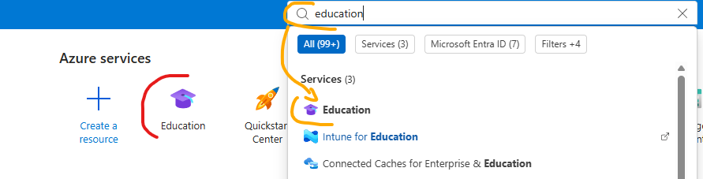

Wähle **Education** um auf folgende Seite zu gelangen. Wähle **Visual Studio Enterprise 2026** in der Liste aus und klicke unten rechts auf **Download**.

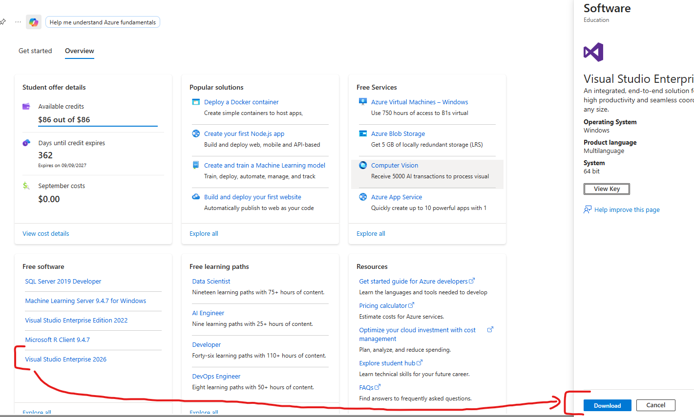

---
### Schritt 2: Workloads auswählen
Führe anschließend den heruntergeladenen **Visual Studio Installer** aus und erteile solange deine Zustimmung bis wir uns auf folgendem Fenster wiederfinden.

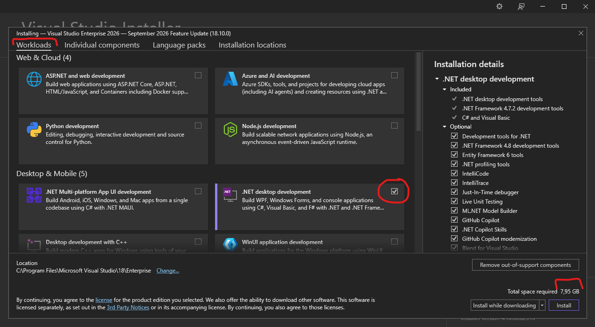

Wähle im Reiter **Workloads** ***nur*** die Option **.NET desktop development**. Drücke noch ***nicht*** auf **Install**. 
>**Anmerkung:** Es sollten ca. 8 GB sein, falls hier mehr steht überprüfe ob nur **.NET desktop development** ausgewählt wurde.

---
### Schritt 3: Einzelne Komponenten hinzufügen
Wechsle in den Reiter **Individual components** *(Einzelne Komponenten)*. Im Bereich **.NET** wähle folgende ``Runtimes``:
* .NET 10.0 Runtime
* .NET 9.0 Runtime
* .NET 8.0 Runtime

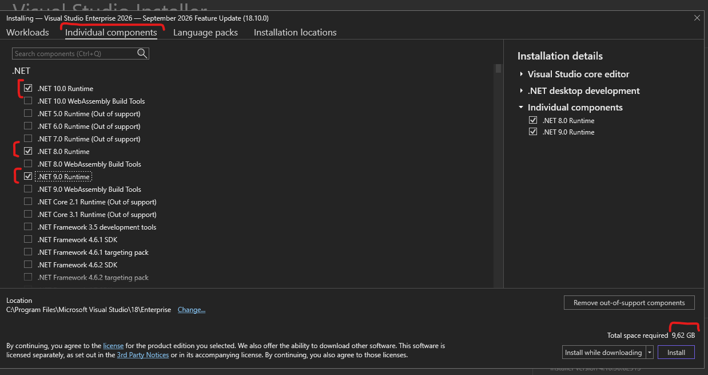

>**Anmerkung:** Falls **Visual Studio 2022** installiert wird, ist die höchst auswählbare Version der ``Runtime`` **.NET 8.0**.

---
### Schritt 4: Sprachpakete wählen und installieren
Gehe in den Reiter **Language packs** (Sprachpakete). Stelle sicher, dass *English* und *German* ausgewählt sind. Klicke anschließend unten rechts auf **Install**. 

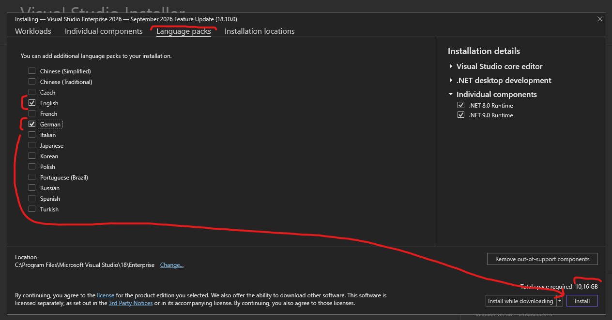

---
### Schritt 5: Visual Studio starten
Suche ***nach*** der Installation im Windows-Startmenü nach dem "Visual Studio Installer". Öffne diesen und klicke bei deiner "Visual Studio Enterprise 2026" Installation auf **Launch**. Alternativ suche und öffne **Visual Studio** direkt. 

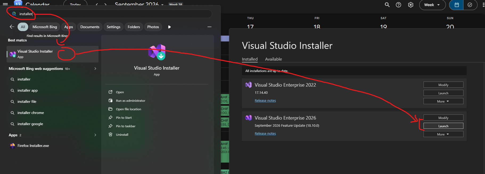

---
### Schritt 6: Neues Projekt beginnen
Klicke im Startbildschirm von **Visual Studio** auf die Option **Create a new ``project``** (Neues ``Projekt`` erstellen).

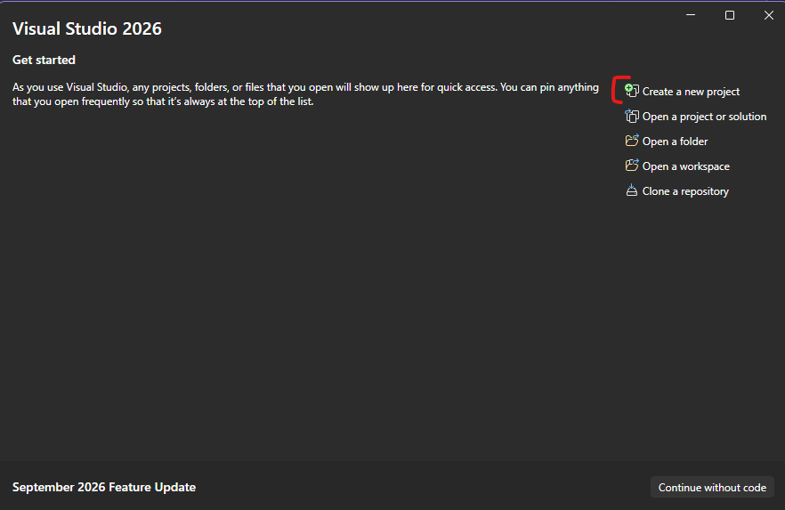

---
### Schritt 7: Projekttemplate auswählen
Suche in der oberen Suchleiste nach *Console-App*. Wähle aus der Liste das ``Projekt-Template`` *(Vorlage)* ``Console-App`` aus und klicke auf **Next**. 

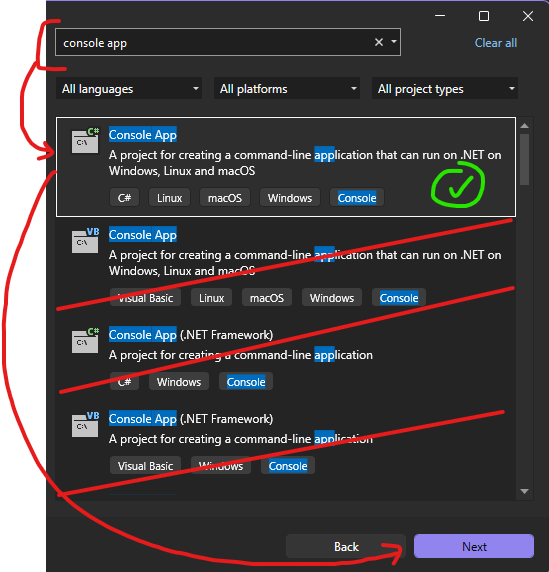

>**Anmerkung:** Die mit *VB* im icon bzw. mit dem Klammerausdruck *(.NET Framework)* gekennzeichneten ``Projekt-Templates`` sind nicht zu verwenden.

---
### Schritt 8: Projekt konfigurieren
Vergib einen **Project name**, zum Beispiel *LeTestProject*, akzeptiere den vorgeschlagenen Speicherort und klicke auf **Next**.

>**Anmerkung:** Wir werden im nächsten Schritt eine Struktur anlegen, welche wir für die Mitschriften, Aufgaben, usw. verwenden. Für jetzt wollen wir einfach wissen ob die Installation erfolgreich war.

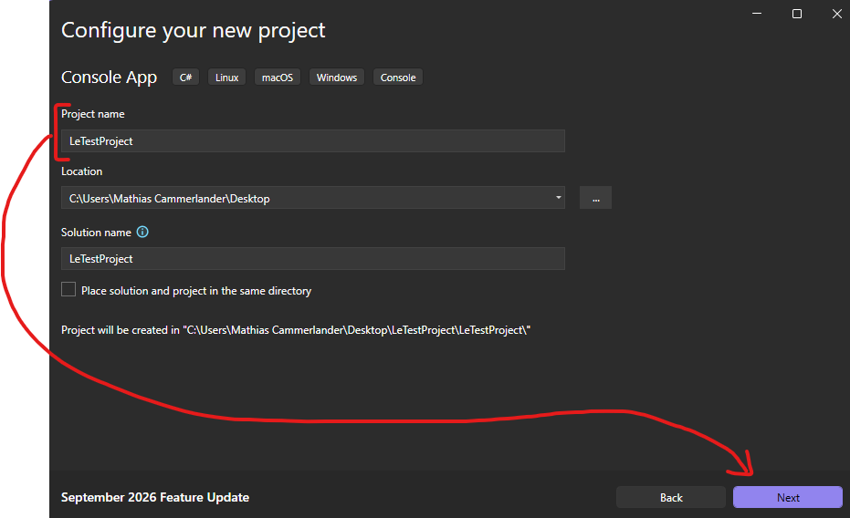

---
### Schritt 9: Framework festlegen
Wähle im Dropdown-Menü *Framework* die Version **.NET 10.0 (Long Term Support)** aus, ändere sonst nichts und drücke unten rechts auf **Create**. 

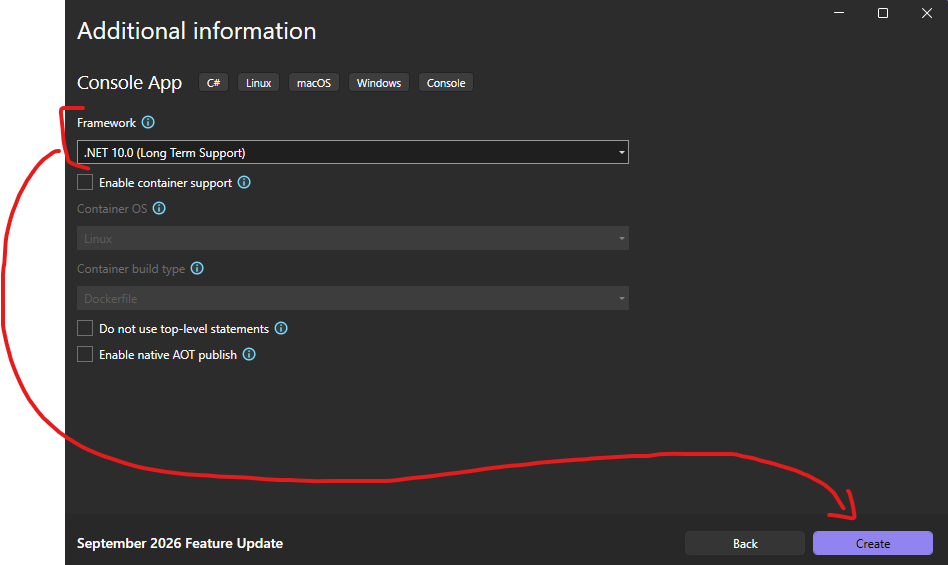

>**Anmerkung:** Falls **Visual Studio 2022** installiert wird, ist die höchst auswählbare Version der ``Runtime`` **.NET 8.0**.

---
### Schritt 10: Programm ausführen
Visual Studio öffnet nun den sich im ``Projekt`` befindlichen ``Entry-Point`` *(Einstiegspunkt)* - das ist unser *Main-``Programm``* mit Namen *Program.cs*. Dort befindet sich unser ``Hello-World-Programm`` *Console.WriteLine("Hello, World!");*. Um zu testen ob alles korrekt installiert wurde, drücke in der oberen Menüleiste auf den grünen, ***ausgefüllten*** Play-Button (mit dem Namen deines Projekts, z.B. **LeTestProject**), um das Programm zu starten. Es öffnet sich die ``Debug``-``Console``, welche erfolgreich den Text **Hello, World!** ausgeben soll.

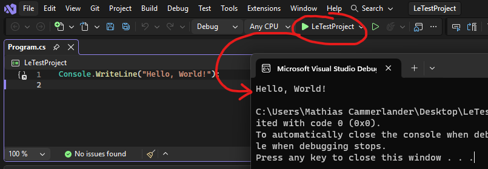

---
### Schritt 11: Product Key abrufen
Wechsle zurück in das ``Microsoft Azure`` Portal in den Bereich **Education**. Wähle in der linken Liste unter *Free software* erneut **Visual Studio Enterprise 2026** aus. Klicke auf der rechten Seite auf den Button **View Key**, um deinen persönlichen Produktschlüssel anzeigen zu lassen, und kopiere diesen.

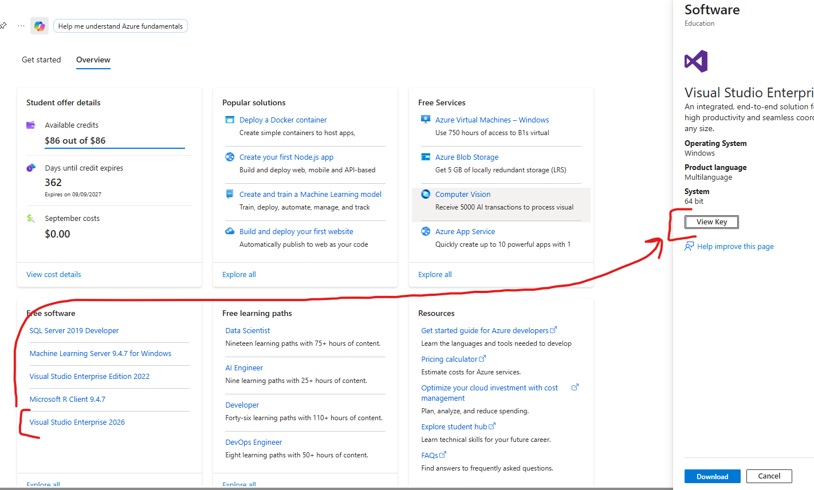

---
### Schritt 12: Registrierungsmenü öffnen
Wechsle nun wieder zurück zu **Visual Studio**. Klicke in der obersten Menüleiste auf **Help** und wähle anschließend den Menüpunkt **Register Visual Studio** aus.

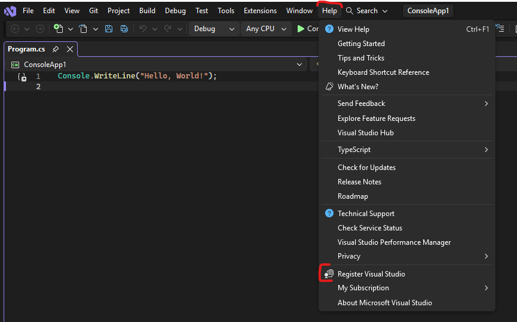

---
### Schritt 13: Product Key eingeben
Klicke im neu geöffneten Fenster auf den blauen Textlink **Unlock with a Product Key** *(Mit einem Product Key entsperren)*. Füge den zuvor kopierten Produktschlüssel in das Eingabefeld **Product key** ein und bestätige den Vorgang durch einen Klick auf **Apply** *(Anwenden)*.

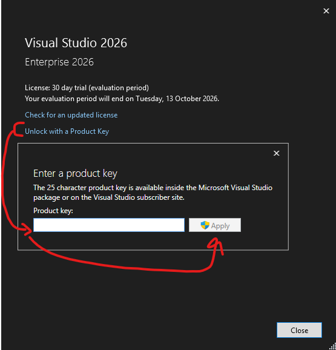

---
### Schritt 14: Lizenzierung überprüfen
Nach erfolgreicher Eingabe sollte im Registrierungsfenster nun die Bestätigung **License: Product key applied** *(Lizenz: Product Key angewendet)* stehen. Damit ist die Installation und Aktivierung deiner Visual Studio Enterprise Version vollständig abgeschlossen.

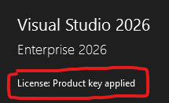