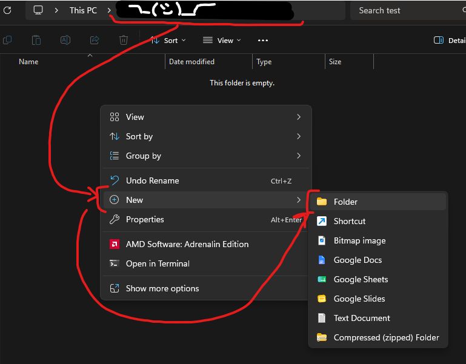
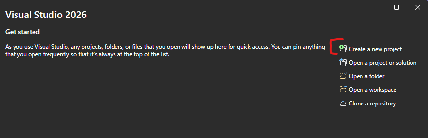
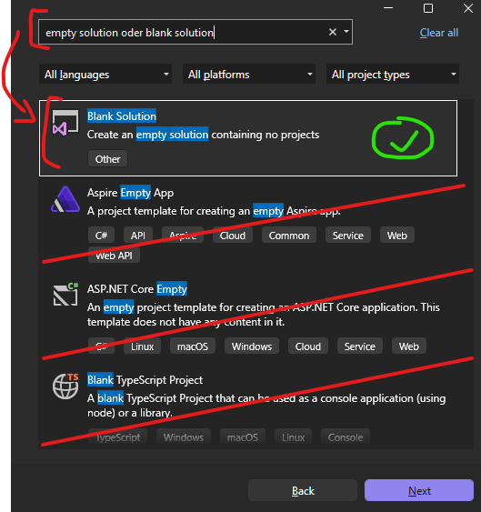
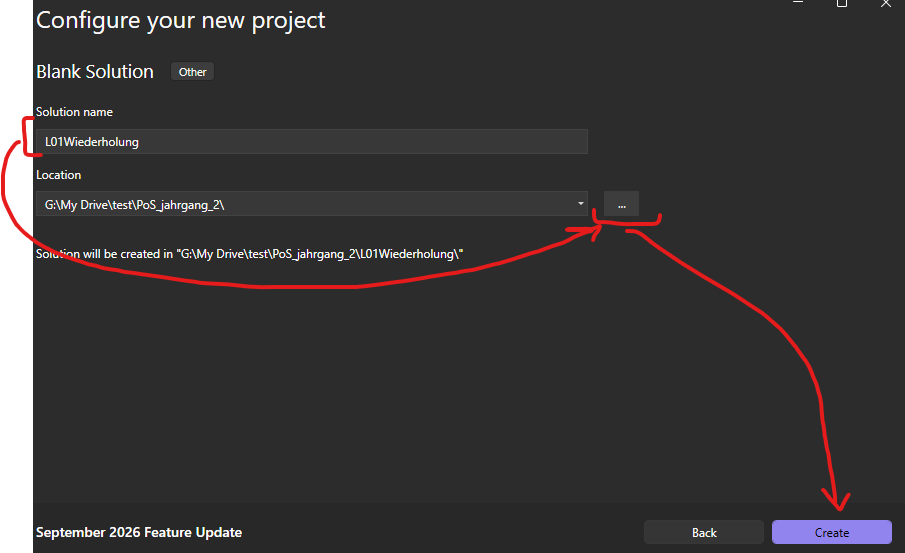
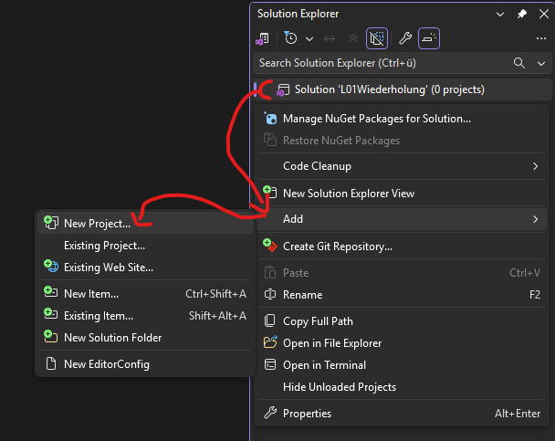
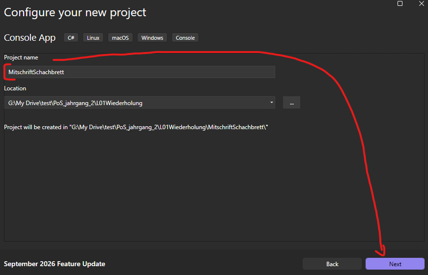
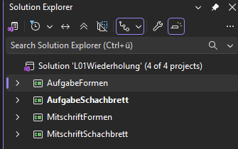
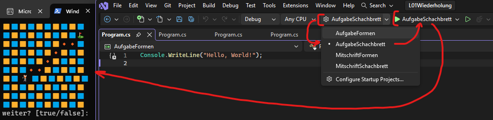

## Visual Studio 2026 - Projektstruktur und Projektmappen anlegen

#### Welche Begriffe werden hier verwendet?
[``Jahrgang``](05_Glossar.md#jahrgang), [``Projekt``](05_Glossar.md#projekt), [``Projektmappe``](05_Glossar.md#projektmappe), [``Solution``](05_Glossar.md#solution), [``Solution Explorer``](05_Glossar.md#solution-explorer), [``Console-App``](05_Glossar.md#console-app), [``Programm``](05_Glossar.md#programm).

### Schritt 1: Ordnerstruktur vorbereiten
Erstelle an einem passenden Speicherort auf deinem Computer einen neuen Ordner für das Fach und dem jeweiligen ``Jahrgang``. Mache dazu einen Rechtsklick in den leeren Bereich, wähle **New** *(Neu)* und anschließend **Folder** *(Ordner)*.

---
### Schritt 2: Neues Projekt beginnen
Starte **Visual Studio** und klicke im Startbildschirm auf **Create a new ``project``** *(Neues ``Projekt`` erstellen)*.

---
### Schritt 3: Leere Projektmappe wählen
Wir wollen in diesem Fall nicht nur ein einzelnes Projekt, sondern eine übergreifende ``Projektmappe`` für mehrere Projekte erstellen. Suche in der Suchleiste nach *empty solution* oder *blank solution*. Wähle das Template **Blank Solution** *(Leere Projektmappe)* aus und klicke auf **Next**.

---
### Schritt 4: Projektmappe benennen und Speicherort festlegen
Vergib unter **Solution name** einen passenden Namen für deine ``Projektmappe``, wie zum Beispiel ``L01Wiederholung``. Klicke bei **Location** auf die Schaltfläche mit den drei Punkten **...**, um den in Schritt 1 erstellten Ordner (z. B. ``PoS_jahrgang_2``) als Speicherort auszuwählen. Klicke abschließend auf **Create** *(Erstellen)*.

>**Anmerkung:** Die ``Projektmappen`` (``Solutions``) sind für eine ``Lektion`` gedacht. Mehrere ``Projektmappen`` heißt mehrere ``Lektionen``.

---
### Schritt 5: Solution Explorer öffnen
Falls er nicht bereits auf der rechten Seite geöffnet ist, müssen wir den ``Solution Explorer`` *(Projektmappen-Explorer)* einblenden. Klicke dazu im oberen Menü auf **View** *(Ansicht)* und wähle **Solution Explorer**.

---
### Schritt 6: Projekt zur Mappe hinzufügen
Mache im ``Solution Explorer`` einen **Rechtsklick** auf die soeben erstellte leere Projektmappe (hier: ``Solution 'L01Wiederholung'``). Navigiere im erscheinenden Kontextmenü zu **Add** *(Hinzufügen)* und klicke auf **New Project...** *(Neues Projekt...)*.

>**Anmerkung:** Ein ``Projekt`` in einer ``Projektmappe`` (``Solution``) stellt entweder eine ``Mitschrift`` oder eine ``Aufgabe`` für die ``Lektion`` dar. Es können beliebig viele ``Projekte`` einer ``Projektmappe`` (``Solution``) hinzugefügt werden.

---
### Schritt 7: Projekt konfigurieren
Wähle als Template wieder die gewohnte ``Console App`` aus. Vergib einen **Project name**, wie beispielsweise ``MitschriftSchachbrett``. Der Speicherort wird automatisch passend in den Ordner der Projektmappe gelegt. Klicke auf **Next** und wähle im nächsten Schritt wie gewohnt ein ``Projekt-Template`` aus, mit der gewünschten ``Runtime`` bevor du auf **Create** klickst.

>**Anmerkung:** Falls nicht klar ist was hier ausgewählt werden soll, lies in der [HowToVisualStudio.md](01_HowToVisualStudio.md) Datei nach.

---
### Schritt 8: Mehrere Projekte verwalten
Wiederhole den Vorgang ([Projekt zur Mappe hinzufügen](#schritt-6-projekt-zur-mappe-hinzufügen) und [Projekt konfigurieren](#schritt-7-projekt-konfigurieren)), um alle benötigten Aufgaben und Mitschriften der Lektion hinzuzufügen. Der ``Solution Explorer`` listet nun alle angelegten ``Projekte`` übersichtlich innerhalb deiner ``Projektmappe`` auf.

---
### Schritt 10: Startprojekt festlegen und ausführen
Da die Mappe nun mehrere Programme enthält, musst du Visual Studio explizit mitteilen, welches davon gestartet werden soll. Wähle im Dropdown-Menü neben dem grünen Play-Button in der oberen Menüleiste das gewünschte ``Projekt`` (z. B. ``AufgabeFormen``) aus. Drücke danach auf den **Play-Button**, um genau dieses spezifische ``Programm`` auszuführen.

>**Anmerkung:** Achte immer darauf, hier das richtige Projekt auszuwählen. Andernfalls startest du versehentlich die falsche Aufgabe, obwohl du gerade in einer anderen Datei Code geschrieben hast!

