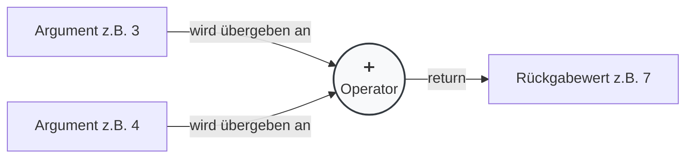
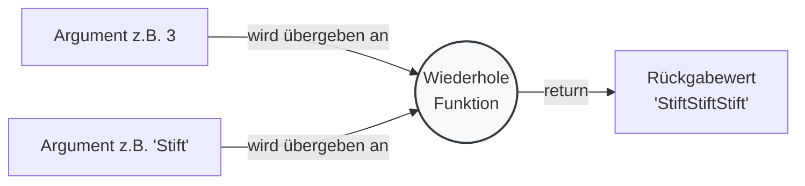
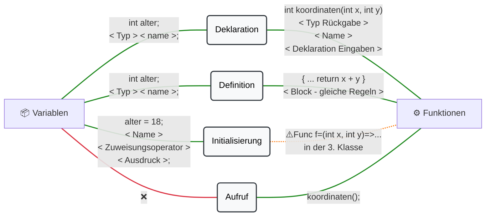

#### Welche Begriffe werden hier verwendet?
[``Anweisung``](../../../05_Glossar.md#anweisung), [``Argument``](../../../05_Glossar.md#argument), [``Aufruf``](../../../05_Glossar.md#aufruf), [``Ausdruck``](../../../05_Glossar.md#ausdruck), [``Ausgangsparameter``](../../../05_Glossar.md#ausgangsparameter), [``Bedingter Ausdruck``](../../../05_Glossar.md#bedingter-ausdruck), [``Block``](../../../05_Glossar.md#block), [``Compiler``](../../../05_Glossar.md#compiler), [``Definition``](../../../05_Glossar.md#definition), [``Deklaration``](../../../05_Glossar.md#deklaration), [``Delegate``](../../../05_Glossar.md#delegate), [``Delegieren``](../../../05_Glossar.md#delegieren), [``Eingangsparameter``](../../../05_Glossar.md#eingangsparameter), [``Funktion``](../../../05_Glossar.md#funktion), [``Initialisierung``](../../../05_Glossar.md#initialisierung), [``Iterative Programmierung``](../../../05_Glossar.md#iterative-programmierung), [``Klasse``](../../../05_Glossar.md#klasse), [``Lambda``](../../../05_Glossar.md#lambda), [``Methode``](../../../05_Glossar.md#methode), [``Methodenkopf``](../../../05_Glossar.md#methodenkopf), [``Methodenkörper``](../../../05_Glossar.md#methodenkörper), [``Name``](../../../05_Glossar.md#name), [``Objekt``](../../../05_Glossar.md#objekt), [``Operator``](../../../05_Glossar.md#operator), [``Prozedurale Programmierung``](../../../05_Glossar.md#prozedurale-programmierung), [``return``](../../../05_Glossar.md#return), [``Rückgabewert``](../../../05_Glossar.md#rückgabewert), [``Schleife``](../../../05_Glossar.md#schleife), [``Schlüsselwort``](../../../05_Glossar.md#schlüsselwort), [``Schnittstelle``](../../../05_Glossar.md#schnittstelle), [``static``](../../../05_Glossar.md#static), [``Teilproblem``](../../../05_Glossar.md#teilproblem), [``Top-Level Statement``](../../../05_Glossar.md#top-level-statement), [``Typ``](../../../05_Glossar.md#typ), [``Variable``](../../../05_Glossar.md#variable), [``Verzweigung``](../../../05_Glossar.md#verzweigung), [``void``](../../../05_Glossar.md#void), [``Wert``](../../../05_Glossar.md#wert), [``Zuweisung``](../../../05_Glossar.md#zuweisung).


Wir haben unsere grundlegenden Werkzeuge kennengelernt und erweitern diese nun um einen essenziellen Baustein - wir verlassen damit die ``Iterative Programmierung`` und gehen zur ``Prozeduralen Programmierung``:
* ✅ Variablen 
* ✅ Operatoren 
* ✅ Verzweigungen und Bedingte Ausdrücke
* ✅ Schleifen
* ➡️ Funktionen (Methoden)

Wir behandeln nun ``Funktionen`` (in zukunft wenn wir ``Klassen`` und ``Objekte`` kennelernen auch ``Methoden`` genannt). Sie sind ein wichtiges Werkzeug, um unseren Code zu *strukturieren*, Aufgaben zu *delegieren* und Logik *wiederverwendbar* zu machen.

---

## Operatoren vs. Funktionen
Wir kennen bereits ``Operatoren`` z.B. wenn wir *+* ``aufrufen``. Dort gibt es ``Argumente`` *3* und *4* welches ``Werte`` sind. Diese werden vom ``Operator`` zu einem neuen ``Wert``, dem ``Rückgabewert`` zu *7* verbunden. Wir wisen nicht genau wie es der ``Operator`` umsetzt, aber wir akzeptiren dass diese *Black-Box* *+* existiert und uns eine *7* aus *3* und *4* erzeugt. Das Genannte ist **1 zu 1** für ``Funktionen`` anwendbar. Diese sind jedoch *flexibler* in deren Gestaltung und besitzen, nicht zwingend vom ``Compiler``, aber zwingend von ***mir***, einen sprechenden ``Namen``. 

> Anmerkung: Die ``Werte`` können natürlich auch ``Variablen`` und allgemein gesprochen ``Ausdrücke`` sein.

---



---



---

Wir können in C# eigene ``Operatoren`` und ``Funktionen`` schreiben, konzentrieren uns aber auf die ``Funktionen`` als Vorbereitung auf ``Methoden``. Wenn wir eigene ``Funktionen`` schreiben, müssen wir zwischen zwei Begriffen trennen. Das *Anlegen* von ``Funktionen`` und den ``Aufruf`` von ``Funktionen``. 

## Deklaration, Definition, Initialisierung, ... Aufruf?
Unser Ziel ist es eine eigene ``Funktion`` zu schreiben. Wir beginnen jedoch nun mit bekannten Begriffen. Die Idee von ``Deklaration``, ``Definition`` und ``Initialisierung`` sind die Selben wie wir es von den ``Variablen`` kennen. Wir ``deklarieren`` sie um den ``Namen`` und ``Typ`` *bekannt zu machen*, ``definieren`` um *Speicher zu reservieren* und ``initialisieren`` sie indem wir einen konkreten ``Wert`` **erstmals**. Weitere Belegungen der ``Variable`` nennen wir ``Zuweisung``. Eine ``Variable`` ist ein Speicherplatz für Daten.

Ein Diagramm um die Fachbegriffe mit ``Variablen`` und ``Funktionen`` aufzuzeigen.


### Deklaration, Methodenkopf, Definition und Methodenkörper 
Wir bemerken, dass beim ``Aufruf`` der ``Funktion`` die ``Werte`` *3* und *7* ``Argumente`` genannt werden. Bei der ``Deklaration`` der ``Funktion`` sind diese jedoch ``Parameter``, genauer gesagt ``Eingangsparameter``. Der ``Rückgabewert`` ist auch nur beim ``Aufruf`` so benannt und wird ``Ausgangsparameter`` bei der ``Deklaration`` der ``Funktion`` genannt.


Wir sehen also, dass eine ``Funktion`` ``deklariert`` wird, wenn wir dem ``Compiler`` foglendes bekannt machen:
1. Den ``Typ`` des ``Rückgabeparameters``, 
2. den ``Name`` der ``Funktion`` und 
3. die ``Eingangsparameter`` ``definieren``.

Wir nennen diesen Abschnitt für die ``Deklaration`` den ``Methodenkopf``.

>Anmerkung: Da wir uns in der ``Main-Methode`` oder dem ``Top-Level-Statement`` vorerst befinden müssen wir das ``Keyword`` *static* als erstes Wort dazuschreiben. Es ist Teil des ``Methodenkopfes``.

Wir versuchen nun eine ``Funktion`` *Wiederhole* zu ``deklarieren``. 
```csharp
// Zustaendigkeit: Erzeuge ein neues Wort aus einem bestehenen Wort und einer Anzahl. Beides wird vom Aufrufer der Funktion gewählt. 
static double Wiederhole(int anzahl, string wort) // Compiler-Fehler....
```

Wir stellen fest, das geht ***alleine*** ohne ``Definition`` nicht. Der ``Methodenkopf`` darf nicht alleine stehen, er braucht seinen ``Methodenkörper``. Es ist aber wichtig sich zuerst Gedanken zu machen was die ``Funktion`` als ``Eingabeparameter`` und ``Ausgabeparameter`` hat. Wir beginnen deshalb *gedanklich immer* mit dem ``Methodenkopf`` und machen *pragmatischerweise* einen leeren ``Methodenkörper`` und ``definieren`` hier eine falsche *Logik*. Wir verwenden hier weider die Idee der ``Zuständigkeiten`` und schreiben diese darüber.

```csharp
// Zustaendigkeit: Erzeuge ein neues Wort aus einem bestehenen Wort und einer Anzahl. Beides wird vom Aufrufer der Funktion gewählt. 
static double Wiederhole(int anzahl, string wort) // KEIN Compiler-Fehler....
{
    return 0.0; // wollen wir wirklich einen Double zurückgeben?
}
```

Nachdem wir uns sicher sind was wir tun wollen und en ``Typ`` *string* als ``Rückgabeparameter`` verwenden wollen, schreiben wir die ``Definition`` der *Logik* in den erzeugten ``Block``. Wir überle

```csharp
// Zustaendigkeit: Erzeuge ein neues Wort aus einem bestehenen Wort und einer Anzahl. Beides wird vom Aufrufer der Funktion gewählt. 
static string Wiederhole(int anzahl, string wort) 
{
    string wiederholtesWort = "";

    // ❌ ungewuenschter Zustand
    if (anzahl <= 1) 
    {
        return "";
    }

    // ✅ gewuenschter Zustand
    for (int i = 0; i < anzahl; i++) 
    {
        wiederholtesWort = wiederholtesWort + wort;
    }

    return wiederholtesWort; 
}
```

>**Anmerkung für ungeduldige:** Eine ``Methode`` können wir erst *später* ``deklarieren`` ohne diese zu ``definieren`` in der ``objektorientierten Programmierung`` mit dem ``Keyword`` *abstract*.

Wir merken uns:
>1. ``Funktionen`` sind ein Werkzeug, um unseren Code zu *strukturieren*, Aufgaben zu ``delegieren`` und Logik *wiederverwendbar* zu machen.
>2. Die ``Deklaration`` einer ``Funktion`` bezeichnen wir als ``Methodenkopf``. Dieser macht den ``Typ`` des ``Ausgangsparameters``, den *Namen* und die ``Eingangsparameter`` dem Compiler bekannt.
>3. Die ``Definition`` einer ``Funktion`` bezeichnen wir als ``Methodenkörper``. Dies ist der ``Block`` `{...}`, welcher die auszuführende *Logik* und Speicherreservierung enthält.
>4. Wenn wir eine ``Funktion`` ``deklarieren``, sprechen wir von ``Eingangsparametern`` und einem ``Ausgangsparameter``.

### Aufruf einer Funktion
Wir ``deklarieren`` und ``definieren`` eine ``Funktion`` um sie später ``aufrufen`` zu können. Wir tun dies folgendermaßen.

```csharp
// ########### Deklaration + Definition ########### 
// Zustaendigkeit: Erzeuge ein neues Wort aus einem bestehenen Wort und einer Anzahl. Beides wird vom Aufrufer der Funktion gewählt. 
static string Wiederhole(int anzahl, string wort) 
{
    string wiederholtesWort = "";

    // ❌ ungewuenschter Zustand
    if (anzahl <= 1) 
    {
        return "";
    }

    // ✅ gewuenschter Zustand
    for (int i = 0; i < anzahl; i++) 
    {
        wiederholtesWort = wiederholtesWort + wort;
    }

    return wiederholtesWort; 
}

// ########### Aufruf ########### 
// Führe den Code aus, der in der Funktion definiert ist!
Wiederhole(7,  "nein"); 
Wiederhole(3,   "Hello"); 
Wiederhole(-25, "¯\\_(ツ)_/¯"); 
```

Wir merken uns:
>5. Wenn wir eine ``Funktion`` ``aufrufen``, übergeben wir ``Ausdrücke``, welche wir ``Argumente`` nennen, und erhalten einen konkreten ``Rückgabewert``.
>6. Eine ``Funktion`` hält ausführbaren Code und wird durch das Anhängen von *runden Klammern ()* ``aufgerufen``.
---

## Wann ist ein Aufruf einer Funktion ein Ausdruck?
Alles was einen ``Wert`` produziert, ist ein ``Ausdruck``. Wenn unsere ``Funktion`` einen den ``Typ`` des ``Rückgabeparameter`` im ``Methodenkopf`` angibt, dann ist der ``Aufruf`` dieser Funktion ein ``Ausdruck``. Er kann auf der rechten Seite einer Zuweisung stehen.

```csharp
// ########### Deklaration + Definition ########### 
// Zustaendigkeit: Erzeuge ein neues Wort aus einem bestehenen Wort und einer Anzahl. Beides wird vom Aufrufer der Funktion gewählt. 
static string Wiederhole(int anzahl, string wort) 
{
    string wiederholtesWort = "";

    // ❌ ungewuenschter Zustand
    if (anzahl <= 1) 
    {
        return "";
    }

    // ✅ gewuenschter Zustand
    for (int i = 0; i < anzahl; i++) 
    {
        wiederholtesWort = wiederholtesWort + wort;
    }

    return wiederholtesWort; 
}

// ########### Aufruf ########### 
// Führe den Code aus, der in der Funktion definiert ist!
string ergebnis = Wiederhole(7,  "nein"); 
Console.WriteLine(ergebnis);

ergebnis = Wiederhole(3,   "Hello"); 
Console.WriteLine(ergebnis);

ergebnis = Wiederhole(-25, "¯\\_(ツ)_/¯"); 
Console.WriteLine(ergebnis);
```

Was aber, wenn die ``Funktion`` einfach nur etwas auf dem Bildschirm ausgeben soll und keinen ``Wert`` berechnet?
Dafür gibt es das Keyword **`void`** (englisch für "leer/nichts").

```csharp
// ########### Deklaration + Definition ########### 
// Zustaendigkeit: Erzeuge ein neues Wort aus einem bestehenen Wort und einer Anzahl 
// und gib es auf der Console aus. Beides wird vom Aufrufer der Funktion gewählt. 
static void WiederholeMitPrint(int anzahl, string wort) 
{
    string wiederholtesWort = "";

    // ❌ ungewuenschter Zustand
    if (anzahl <= 1) 
    {
        Console.WriteLine(""); 
        return; // Ein nacktes 'return' beendet eine void-Methode vorzeitig!
    }

    // ✅ gewuenschter Zustand
    for (int i = 0; i < anzahl; i++) 
    {
        wiederholtesWort = wiederholtesWort + wort;
    }

    // kein return
    Console.WriteLine(wiederholtesWort); 
}

// ########### Aufruf ########### 
// Führe den Code aus, der in der Funktion definiert ist!
// Da die Methode 'void' ist, ist der Aufruf nun eine reine Anweisung (Statement).
// Es gibt keinen Rückgabewert mehr, den wir einer Variable zuweisen könnten.

WiederholeMitPrint(7,  "nein"); 
WiederholeMitPrint(3,   "Hello"); 
// string ergebnis = WiederholeMitPrint(-25, "¯\\_(ツ)_/¯"); // Fehler!
```

Wir merken uns:
>7. Wenn eine ``Funktion`` einen ``Rückgabeparameters`` besitzt, verhält ihr ``Aufruf`` sich wie ein ``Ausdruck`` und generiert einen ``Wert``.
>8. Wenn eine ``Funktion`` als Rückgabe das Keyword ``void`` besitzt, verhält sich ihr ``Aufruf`` wie eine reine ``Anweisung`` und generiert **keinen** ``Wert``.
>9. Das Keyword ``return`` beendet die ``Funktion`` und liefert das Ergebnis zurück. Bei **void**-Methoden kann ein *nacktes* **return;** genutzt werden, um die Methode vorzeitig abzubrechen.
---

## Das Wichtigste: Schnittstellen und das Delegieren von Aufgaben

Warum schreiben wir ``Funktionen``? Die naive Antwort wäre: "Um uns Tipparbeit zu sparen, wenn wir Code mehrmals brauchen." Das stimmt zwar, ist aber nicht der Hauptgrund.

Der wichtigste Grund ist **Kommunikation** und **Verantwortung**.

Wenn wir eine Funktion ``deklarieren``, legen wir eine ``Schnittstelle`` fest die eingehalten werden **muss**. 
Der ``Methodenkopf`` *static int BerechneSteuer(decimal betrag)`* ist wie ein Vertrag: 
*"Gib mir eine Zahl (den Betrag), kümmere dich nicht darum, wie ich es intern mache, und ich garantiere dir, du bekommst am Ende die Steuer als ganze Zahl zurück."*

Durch diese ``Schnittstellen`` lagern wir ``Teilprobleme`` aus. Wir ``delegieren`` Aufgaben an unsere ``Funktionen``. Die ``Main-Methode`` unseres Programms wird dadurch übersichtlich, weil sie nicht mehr jedes Detail selbst kennen muss. Sie ``delegiert``die Arbeit einfach an andere ``Funktionen``, die *Experten* für dieses konkrete Detail sind. 

Wir haben zudem gesehen, dass ``Funktionen`` meistens ``Ausdrücke`` sind. Das bedeutet sie erzeugen einen ``Wert``, welcher wieder in eine ``Funktion`` als ``Argument`` übergeben weren kann. Sofern der ``Typ`` der ``Eingangsparmeter`` mit dem des ``Ausgabeparameters`` übereinstimmt.

```csharp
// ########### Deklaration + Definition ########### 
static int Addiere(int a, int b) 
{
    return a + b;
}

static int Quadriere(int zahl) 
{
    return zahl * zahl;
}

// ########### Aufruf im Hauptprogramm ########### 

// Variante 1: Schritt-für-Schritt mit Zwischenvariablen
int summe = Addiere(2, 3);        // summe wird zu 5
int ergebnis = Quadriere(summe);  // ergebnis wird zu 25
Console.WriteLine(ergebnis);

// Variante 2: Der geschachtelte Aufruf (Kompakt)
int schnellesErgebnis = Quadriere(Addiere(2, 3)); // ergebnis wird zu 25
Console.WriteLine(schnellesErgebnis); 
```

Wir merken uns:
>10. Die ``Deklaration`` einer ``Funktion`` stellt eine ``Schnittstelle`` dar, an welche wir komplexe ``Teilprobleme`` ``delegieren``.
>11. Der ``Aufruf`` von ``Funktionen`` kann *geschachtelt* werden, solange der ``Typ`` des ``Rückgabeparameters`` der *inneren* ``Funktion`` zum ``Eingangsparameter`` der *äußeren* Funktion passt.