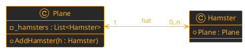

**Schriftliche Mitarbeitsüberprüfung - Arrays, Objekte und Klassen**
PoS - CAMM - 3CHIF - Gruppe A

**Name:** 
_ _ _ _ _ _ _ _ _ _ _ _ _ _ _ _ _ _ _ _ _ _ _ _ _ _ _ 
**Datum:** 
28.09.2026

## Aufgabe 1 - **2D - Arrays**
Vervollständige den folgenden Code, indem die fehlenden Zeichen, ``Indizes`` oder ``Methodenaufrufe`` in die Lücken (`___`) einträgst.

```csharp
// 1. Ein neues 2D-Array vom Typ string erstellen (4 Zeilen, 5 Spalten)
string[___] brett = _________ string[_, _];

// 2. Einen Hamster "🐹" in der 3. Zeile und 2. Spalte platzieren
brett[___, ___] = "🐹";

// 3. Das gesamte Array mit einer verschachtelten Schleife durchlaufen
for (int y = 0; y < ____________; y++)
{
    for (int x = 0; x < ____________; x++)
    {
        // 4. Den aktuellen Wert des Arrays soll nur für ungerade Indices ausgegeben werden.
        ________
        ________
            Console.Write(________);
        ________
    }
    Console.WriteLine();
}
```

## Aufgabe 2 - **Konzepte**
1. Beschreibe den Unterschied zwischen ``Objekte`` und ``Klassen``.
$\\$
$\\$
$\\$
$\\$
$\\$
$\\$

2. Wir wollen "Arbeit von einem ``Objekt`` an ein anderes ``Objekt`` delegieren". Was muss ``Objekt`` *a* der ``Klasse`` *A* besitzen, wenn es ein ``Objekt`` *b* der ``Klasse`` *B* mit der ``Methode`` *foo* gibt?
$\\$
$\\$
$\\$
$\\$
$\\$
$\\$
$\\$
$\\$
$\\$

## Aufgabe 3 -  **Klassendiagramm**



Kreuze für die folgende Variante an, ob die 
1. ``Bidirektionalität`` auf der Ebene der ``Klassen`` oder 
2. der Ebene der ``Objekte`` korrekt hergestellt wird. 
3. Ebenso ob die ``Multiplizität`` ***immer*** korrekt implementiert ist.

```csharp
public class Plane 
{
    private List<Hamster> _hamsters = new List<Hamster>();

    public void AddHamster(Hamster hamster) 
    {
        _hamsters.Add(hamster);
        hamster.Plane = this;
    }
}

public class Hamster 
{
    private Plane _plane;
    public Plane Plane { 
        get {
            return _plane
        } 
        set {
            if (value != null) 
            {
                _plane = value;
                _plane.AddHamster(this); 
            }
        } 
    }
}
```
**Objektebene bidirektional?**&emsp;&emsp;&emsp;&nbsp;🔲 Ja  🔲 Nein
**Klassenebene bidirektional?**&emsp;&emsp;&emsp;🔲 Ja  🔲 Nein
**Multiplizität ***immer*** eingehalten?**&emsp;🔲 Ja  🔲 Nein
**Optionale Anmerkungen:**