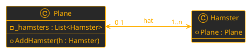

**Schriftliche Mitarbeitsüberprüfung - Arrays, Objekte und Klassen**
PoS - CAMM - 3CHIF - Gruppe B

**Name:** 
_ _ _ _ _ _ _ _ _ _ _ _ _ _ _ _ _ _ _ _ _ _ _ _ _ _ _ 
**Datum:** 
28.09.2026

## Aufgabe 1 - **2D - Arrays**
Vervollständige den folgenden Code, indem die fehlenden Zeichen, ``Indizes`` oder ``Methodenaufrufe`` in die Lücken (`___`) einträgst.

```csharp
// 1. Ein neues 2D-Array vom Typ string erstellen (5 Zeilen, 6 Spalten)
string[___] brett = _________ string[_, _];

// 2. Einen Fuchs "🦊" in der 2. Zeile und 4. Spalte platzieren
brett[___, ___] = "🦊";

// 3. Das gesamte Array mit einer verschachtelten Schleife durchlaufen
for (int y = 0; y < ____________; y++)
{
    for (int x = 0; x < ____________; x++)
    {
        // 4. Nur wenn eine Huhn 🐔 am Feld ist, soll darüber ein 🦊 gelegt werden.
        ________
        ________
            brett[___, ___] = ___;
        ________
    }
    Console.WriteLine();
}
```

## Aufgabe 2 - **Konzepte**
1. Wie hängen ``Klassen`` mit ``Typen`` und ``Objekte`` mit ``Variablen`` zusammen?
$\\$
$\\$
$\\$
$\\$
$\\$
$\\$

2. Sind ``Eigenschaften`` ``Methoden`` oder ``Variablen``? Wie setze ich ``Data-Hiding`` bei ``Eigenschaften`` um?
$\\$
$\\$
$\\$
$\\$
$\\$
$\\$
$\\$
$\\$

## Aufgabe 3 -  **Klassendiagramm**



Kreuze für die folgenden Variante an, ob die 
1. ``Bidirektionalität`` auf der Ebene der ``Klassen`` oder 
2. der Ebene der ``Objekte`` korrekt hergestellt wird. 
3. Ebenso ob die ``Mutiplizität`` ***immer*** korrekt implementiert ist.
```csharp
public class Plane 
{
    private List<Hamster> _hamsters = new List<Hamster>();

    public Plane(Hamster hamster)
    {
        AddHamster(hamster);
    }

    public void AddHamster(Hamster hamster) 
    {
        _hamsters.Add(hamster);
    }
}
public class Hamster 
{
    public Plane Plane { get; set; }
}
```
**Klassenebene bidirektional?**&emsp;&emsp;&emsp;🔲 Ja  🔲 Nein
**Objektebene bidirektional?**&emsp;&emsp;&emsp;&nbsp;🔲 Ja  🔲 Nein
**Mutiplizität ***immer*** eingehalten?**&emsp;🔲 Ja  🔲 Nein
**Optionale Anmerkungen:**