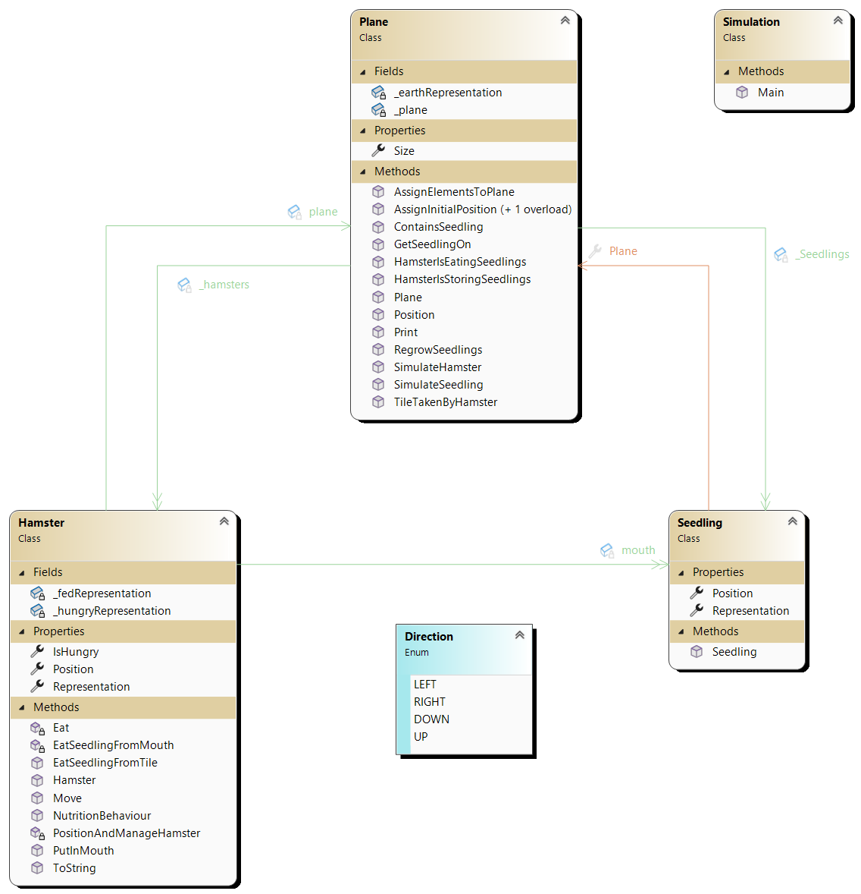

#### Welche Begriffe werden hier verwendet?
[``Klasse``](../../../05_Glossar.md#klasse), [``Objekt``](../../../05_Glossar.md#objekt), [``Instanziierung``](../../../05_Glossar.md#instanziierung), [``Identität``](../../../05_Glossar.md#identität), [``Eigenschaft``](../../../05_Glossar.md#eigenschaft), [``Feld``](../../../05_Glossar.md#feld), [``Zustand``](../../../05_Glossar.md#zustand), [``Methode``](../../../05_Glossar.md#methode), [``Mitglied``](../../../05_Glossar.md#mitglied), [``Assoziation``](../../../05_Glossar.md#assoziation), [``Navigierbarkeit``](../../../05_Glossar.md#navigierbarkeit), [``Multiplizität``](../../../05_Glossar.md#multiplizität), [``Schnittstelle``](../../../05_Glossar.md#schnittstelle), [``Datenabstraktion``](../../../05_Glossar.md#datenabstraktion), [``UML``](../../../05_Glossar.md#uml).

# Klassen, Objekte und Klassendiagramme

Wenn Softwareprojekte wachsen, wird es unmöglich, den gesamten Code im Kopf zu behalten. Hier kommt ``UML`` (*Unified Modeling Language*) ins Spiel. ``UML`` ist eine standardisierte, grafische Sprache welche genutzt wird um die Struktur und das Verhalten von Software zu planen und zu dokumentieren. Eines von vielen dieser Diagramme ist ein ``UML``-``Klassendiagramm``. Dieses ist ein grober "*welche Komponenten gibt es überhaupt*" Bauplan. Es zeigt uns, welche ``Klassen`` existieren und wie diese miteinander in Verbindung stehen. Ein ``Klassendiagramm`` kann aus bestehendem Code für *Dokumentationszwecke* generierten bzw. bevor eine Zeile Code geschrieben wird für *Planungszwecke* gezeichnet werden. 

>**Wir merken uns:**
>1) ``UML`` ist eine standardisierte grafische Sprache zur Planung und Dokumentation von Softwarestrukturen.
>2) Ein ``Klassendiagramm`` stellt dar welche ``Klassen`` in unserer ``Domäne`` existieren und wie diese miteinander in Verbindung stehen. Weiters werden die ``Mitglieder`` einer ``Klasse`` sichtbar gemacht.

## Was sind Klassen und was Objekte?

Eine ``Klasse`` ist ein *Bauplan* für ``Objekte``. Stellen wir uns einen Eintrag für *Hamster* in einem Biologiebuch vor. Dort steht geschrieben, dass ein *Hamster* ein *Gewicht* hat, eine *Farbe* besitzt und *fressen* kann. Aber dieses *Buch selbst* kann keine Körner fressen. Es beschreibt nur, *was* ein Hamster ist und *was* er kann - eine ``Klasse``. 

>Anmerkung: Der Unterschied zu ``structs`` wird im Skriptum [Value vs. Reference Types](TODO) und [Polymorphismus](TODO) behandelt.

Basierend auf der in einer ``Klasse`` aufgelistetem ``Verhalten`` und ``Zustand`` wird nun ein ``Objekt`` gebaut.
Damit wir im Programm tatsächlich mit einem *Hamster* arbeiten können, müssen wir aus dem Bauplan ein konkretes Individum erschaffen. Diesen Vorgang nennen wir ``Instanziierung``, welches wir mithilfe des ``Keywords`` *new* und einem Aufrufs des ``Konstruktor`` umgesetzt werden kann. Das Resultat ist ein ``Objekt``. Es existiert nun physisch im Arbeitsspeicher ein *Individum* welches einen ``Zustand`` und ``Verhalten`` abbilden kann. Der konkrete Hamster *gerry* hat nun ein konkretes Gewicht von *400g*, eine *Graue* Fellbarbe und frisst gerade Körner. Der *Hamster* *samara* ist anders. *350g*, *gelbes* Fell und frisst gerade keine Körner. Was beide ``Objekte`` teilen ist die *Möglichkeit* Körner zu fressen und eine Fellfarbe bzw. ein Gewicht zu haben, welches in der ``Klasse`` spezifiert ist. ``Objekte`` haben damit eine ``Identität`` auch wenn diese *gleich* aussehen, gleich schwer sind, sind diese an zwei verschiedenen Orten im Arbeitsspeicher. Sie sind ``gleich`` aber nicht ``ident``. 

Ein ``Objekt`` setzt sich aus zwei Hauptbestandteilen zusammen welche wir zusammen ``Mitglieder`` nennen.
* ``Felder`` und ``Eigenschaften``: Welche Werte hat dieser konkrete Hamster gerade? Diese bilden den ``Zustand`` eines ``Objektes`` ab und sind in der ``Klasse`` ``deklariert`` und ``Initialisiert``.
* ``Methoden``: Was kann dieser Hamster tun? Dieser kann z.B. *void fressen()* Diese bilden das ``Verhalten`` eines ``Objektes`` ab und sind in der ``Klasse`` ``deklariert``, ``definiert`` und manchmal ``initialisiert``.

>**Wir merken uns:**
>3) Eine ``Klasse`` ist der Bauplan für ein ``Objekt`` und beschreibt der ``Zustand`` und ``Verhalten`` eines ``Objektes``.
>4) Ein ``Objekt`` ist ein konkretes *Individuum* und wird als ``Instanz`` einer ``Klasse`` bezeichnet. 
>5) Ein ``Objekt`` wird durch ``Instanziierung`` mit dem ``Schlüsselwort`` `new` und dem Aufruf eines ``Konstruktors`` aus der ``Klasse`` physisch im *Arbeitsspeicher* angelegt.
>6) Ein ``Objekt`` besteht aus ``Eigenschaften``/``Feldern`` für dessen ``Zustand`` und ``Methoden`` für dessen Verhalten. Wir nennen diese Bestandteile zusammen ``Mitglieder``.
>7) Jedes ``Objekt`` besitzt eine eindeutige ``Identität``. Selbst wenn zwei ``Objekte`` den exakt gleichen ``Zustand`` haben, sind es zwei völlig unabhängige *Individuen*.

### Sind Klassen Typen und Objekte Variablen?
Kurz gesagt, ja. Wir setzen nun in C# die Idee einer ``Klasse`` und eines ``Objektes`` mithilfe bekannter Werkzeuge um - mit ``Typen`` und ``Variablen``. Eine ``Klasse`` verhält sich zu einem ``Objekt`` exakt so, wie sich ein ``Typ`` zu einer ``Variablen`` verhält. Wenn wir programmieren, legen wir mit dem ``Typ`` die Struktur fest. Die ``Variable`` ist dabei nur der benannte Platzhalter im Code. Weisen wir diesen ``Variablen`` zur Laufzeit durch ``Instanziierung`` (mit `new`) jedoch tatsächlichen Speicherplatz und konkrete Werte zu, nennen wir dieses greifbare Resultat im Arbeitsspeicher ein ``Objekt`` – eine ``Klasse`` ist also ein *selbst definierter* ``komplexer Typ``, und ein ``Objekt`` ist der Inhalt, den eine ``Variable`` dieses ``Typs`` annimmt.

>**Wir merken uns:**
>7) Eine ``Klasse`` wir mithilfe eines ``Typen`` in C# umgesetzt und ein ``Objekt`` mithilfe einer ``Variable``.

## Was sind Klassendiagramme?

Wir bilden einem ``Klassendiagramm`` unsere ``Domäne`` auf der *Ebene* der ``Klassen`` ab. In der ``Domäne`` sind alle *Dinge* die in unserer Software als *Konzept* vorkommen sollen. Wenn wir einen *Hamster* mit *Seedlings* auf einer *Plane* laufen lassen wollen, dann brauchen wir diese *Konzepte* in unserer Software. Diese *Konzepte* setzen wir mit ``Klassen`` um. Die *Ebene* der ``Klassen`` bedeutet, dass wir uns **nicht** um einzelne *Individuen* kümmern, sondern modellieren etwas was **alle** ``Objekte`` unabhänig von Ihrer ``Identität`` betrifft - wir reden also über ``Klassen``.

### Was gibt es in einem Klassendiagramm zu sehen?
Mit einer *Box* wird die ``Klasse`` dargestellt und der *Name* dieser oben hingeschrieben. Darunter befinden sich die ``Mitglieder``. Zuerst die ``Felder`` und ``Eigenschaften`` welche den ``Zustand`` darstellen. Weiter darunter die ``Methoden`` welche das ``Verhalten`` abbilden. ``Methoden`` sind ``Funktionen`` welche an einer ``Klasse`` oder einem ``Objekt`` hängen.

Wäre das alles, hätten wir unzusammenhängende Blöcke von ``Klassen`` modelliert. Wir verwenden nun zwei ``Beziehungen`` welche wir als *Linien* zwischen den ``Klassen`` darstellen.

## Beziehungen zwischen Klassen im Diagramm
Ein *Hamster* allein kann nicht viel tun, wenn er in einem leeren, schwarzen Nichts schwebt. ``Objekte`` müssen miteinander interagieren.

### Die Hat-Beziehung als Assoziation
Wenn ein ``Objekt`` ein anderes ``Objekt`` benötigt, um eine Aufgabe zu erledigen, ``delegiert`` es diese Arbeit. Diese Verbindung nennen wir ``Assoziation`` welche eine spezielle ``Hat-Beziehung`` ist. Im folgenden ``Klassendiagramm`` sehen wir die bereits geannten Komponenten

*   **Assoziation: 1-zu-1 mit ``Felder`` oder ``Eigenschaften``:** Wenn eine ``Klasse`` ein einzelnes ``Objekt`` speichert, zeigt Visual Studio eine einfache Assoziationslinie mit einer Spitze $\rightarrow$. Beispiel: Ein grüner Pfeil führt von `Hamster` zu `Plane` mit der Beschriftung `plane`, was bedeutet, dass der Hamster genau ein Plane-Objekt als Feld speichert. Wir sprechen "**Der Hamster *hat* ein Spielfeld**".
*   **Assoziation: 1-zu-n mit ``Listen`` / ``Arrays`` :** Wenn eine ``Klasse`` eine Menge von anderen ``Objekten`` speichert, wird dies ebenfalls als Linie dargestellt. Beispiel: Pfeile führen von `Plane` zu `Hamster` (Beschriftung `_hamsters`) und zu `Seedling` (Beschriftung `_Seedlings`). Wir sprechen "**Das Spielfeld *hat* viele Hamster**".
*   **Unidirektional:** Die Pfeilspitzen geben die *Richtung* an in der wir die ``Assiziation`` lesen. Ein Pfeil von *Hamster* zu *Seedling* bedeutet, dass der Hamster die Körner in seinem Mund kennt und methodisch ansteuern kann. Der *Seedling* jedoch nicht.
*   **Bidirektionalität:** Es kennen sich `Plane` und `Seedling` gegenseitig. Auf der ``Objektebene`` existiert hier also eine ``bidirektionale`` ``Assoziation``. Wir zeichnen eine Linie welche **kein** Pfeilspitzen hat, oder wie hier im ``Klassendiagramm`` *zwei* Linien, wie zwischen *Plane* und *Hamster*. 

>**Wir merken uns zu Assoziationen und Beziehungen:**
>1) Wir nutzen eine ``Assoziation`` (``Hat-Beziehung``) um *Aufgaben* an andere ``Objekte`` zu *delegieren*. Der Hamster *delegiert* z. B. die Frage "Ist das Feld vor mir leer?" an das Spielfeld.
>2) Ein ``Objekt`` *delegiert* Arbeit an ein anderes ``Objekt`` unter der Verwendung der ``Methoden`` des anderen ``Objektes``. Das Ergebnis bekommen wir, ohne zu wissen, wie es im Detail erledigt wurde.
>3) Wenn nur ein ``Objekt`` das andere kennt, ist die Beziehung ``unidirektional``. Wenn beide sich gegenseitig referenzieren, ist sie ``bidirektional``.
>4) Wir schreiben ``Multiplizitäten`` an die Linien im klassischen UML-Diagramm, um zu zeigen, wie viele ``Objekte`` beteiligt sind (z.B. *1* für ein Objekt, oder *0..** für Listen/Arrays).
>5) Eine ``unidirektionale`` Beziehung auf ``Objektebene`` bedeutet: ``Objekt`` A kennt ``Objekt`` B, aber ``Objekt`` B kennt dasselbe ``Objekt`` A nicht.
>6) Eine ``unidirektionale`` Beziehung auf ``Klassenebene`` bedeutet: ``Klasse`` A ist so programmiert, dass sie ``Klasse`` B kennt, aber ``Klasse`` B kennt ``Klasse`` A im Code überhaupt nicht.
>7) Eine ``bidirektionale`` Beziehung auf ``Objektebene`` bedeutet: ``Objekt`` A kennt ``Objekt`` B, und ``Objekt`` B kennt exakt dasselbe ``Objekt`` A zurück.
>8) Eine ``bidirektionale`` Beziehung auf ``Klassenebene`` bedeutet: ``Klasse`` A kennt ``Klasse`` B in ihrem Code, und ``Klasse`` B kennt ``Klasse`` A in ihrem Code. 

### 2. Die Ist-Beziehung (Vererbung und Implementierung)
Neben der Hat-Beziehung gibt es die Ist-Beziehung. Sie drückt aus, dass eine ``Klasse`` eine spezialisierte Version einer anderen ist (Ein Hund *ist ein* Tier). Hierbei unterscheiden wir primär drei Konstrukte:
*   **`class` (Klasse):** Eine normale Klasse kann von genau einer anderen Klasse erben und übernimmt deren ``Mitglieder``.
*   **`abstract class` (Abstrakte Klasse):** Eine Basisklasse, die selbst nicht instanziiert werden darf. Sie kann fertigen Code enthalten, aber auch Platzhalter-Methoden, die zwingend von den erbenden Klassen ausgefüllt werden müssen.
*   **`interface` (Schnittstelle):** Ein reiner Vertrag. Ein ``Interface`` enthält keinen ausführbaren Code, sondern diktiert nur, welche ``Eigenschaften`` und ``Methoden`` vorhanden sein müssen. Eine ``Klasse`` kann beliebig viele Interfaces implementieren.

>**Wir merken uns zur Vererbung:**
>1) Die **Ist-Beziehung** beschreibt, dass ein Typ eine konkrete Ausprägung eines anderen, allgemeineren Typs ist. Dies wird über Vererbung (`class`), Basisklassen (`abstract class`) oder reine Verträge (`interface`) realisiert (Details siehe [L03-Polymorphismus.md](L03-Polymorphismus.md)).