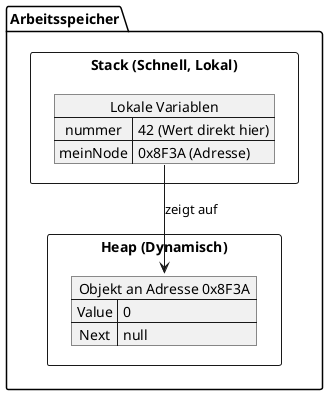

#### Welche Begriffe werden hier verwendet?
[``Bedingte Anweisung``](../../../05_Glossar.md#bedingte-anweisung), [``Bedingung``](../../../05_Glossar.md#bedingung), [``De Morgan'sches Gesetz``](../../../05_Glossar.md#de-morganschen-gesetz), [``early exit``](../../../05_Glossar.md#early-exit), [``Exception``](../../../05_Glossar.md#exception), [``Guard Clause``](../../../05_Glossar.md#guard-clause), [``Logische Operatoren``](../../../05_Glossar.md#logische-operatoren), [``negieren``](../../../05_Glossar.md#negieren), [``return``](../../../05_Glossar.md#return), [``throw``](../../../05_Glossar.md#throw), [``verschachtelte Verzweigung``](../../../05_Glossar.md#verschachtelte-verzweigung), [``Verzweigung``](../../../05_Glossar.md#verzweigung), [``Wahrheitstabelle``](../../../05_Glossar.md#wahrheitstabelle).

# Verkettete Listen und Referenzen

Bevor wir uns ansehen, wie wir selbst ``Datenstrukturen`` wie eine `Linked List` programmieren, müssen wir verstehen, wie C# mit dem Arbeitsspeicher umgeht. Ohne ein klares Verständnis von ``Referenzen`` werden uns ``verkettete Listen`` möglicherweise Probleme bereiten.

---

## 1. Was sind Referenzen und was ist *null*?

Wir wissen ``Variable`` sind *Platzhalter* für ``Werte``. Wir brechen nun diesen *Merkspruch* ein wenig auf und unterscheiden zwischen ``Variablen`` welche *Platzhalter* für ``Referenzen`` sind und jene die *Platzhalter* für ``Werten`` sind.

Eine **Referenz** ist im Grunde ein Verweis – ähnlich wie eine Adresse. Wenn du jemandem die Adresse deines Hauses gibst, gibst du ihm nicht das Haus selbst, sondern nur den *Weg* dorthin. Genauso funktioniert eine Referenz im Code: Sie enthält nicht die eigentlichen Daten (das Objekt), sondern nur die Speicheradresse, wo diese Daten im Arbeitsspeicher zu finden sind.

* **Was ist `null`?** 
  Wenn eine Referenzvariable auf *nichts* zeigt, hat sie den Wert `null`. Das bedeutet: "Ich habe hier einen Zettel für eine Adresse, aber er ist leer." Ein Zugriffsversuch auf eine `null`-Referenz führt zur berüchtigten `NullReferenceException` ❌.

---

## 2. Werttypen vs. Referenztypen & deren Semantik

In C# unterscheiden wir streng zwischen zwei Arten von Datentypen:

### Werttypen (Value Types)
Dazu gehören einfache Datentypen wie `int`, `double`, `bool` oder auch `struct`. 
* **Wert-Semantik:** Wenn du einen Werttyp an eine andere Variable zuweist (`a = b`), wird der **Wert kopiert**. Änderst du danach `a`, bleibt `b` davon unberührt. Jeder hat seine eigene unabhängige Kopie.

### Referenztypen (Reference Types)
Dazu gehören `class`, `string`, Arrays (`int[]`) und im Grunde alle komplexen Objekte.
* **Referenz-Semantik:** Wenn du einen Referenztyp zuweist (`objA = objB`), wird **nicht das Objekt kopiert**, sondern nur die *Adresse*. Beide Variablen zeigen nun auf dasselbe Objekt im Speicher. Änderst du `objA.Value`, ändert sich auch `objB.Value`, denn es ist dasselbe Haus, nur mit zwei verschiedenen Wegweisern!

---

## 3. Stack und Heap: Wo leben unsere Daten?

Um zu verstehen, warum sich Wert- und Referenztypen so verhalten, müssen wir in den Arbeitsspeicher (RAM) schauen. Dieser wird vom Programm grob in zwei Bereiche aufgeteilt: den **Stack** (Stapelspeicher) und den **Heap** (Halden- oder Freispeicher).

* **Der Stack:** Hier landen alle lokalen Variablen und Methodenaufrufe. Der Stack ist extrem schnell, aufgeräumt und arbeitet nach dem LIFO-Prinzip (Last In, First Out). **Werttypen** werden direkt hier mit ihrem echten Wert gespeichert. Bei **Referenztypen** liegt hier nur die *Referenz* (die Adresse).
* **Der Heap:** Das ist der große, dynamische Speicherbereich. Hier werden alle Objekte (Instanzen von Klassen) gespeichert, wenn wir das Schlüsselwort `new` verwenden. 

Hier ist ein Diagramm, das verdeutlicht, was bei folgendem Code im Speicher passiert:

```csharp
int nummer = 42; 
Node meinNode = new Node();
```



Wie du siehst: Der `int`-Wert liegt direkt auf dem Stack. Das `Node`-Objekt liegt auf dem Heap, und auf dem Stack liegt nur die Adresse (`0x8F3A`), die dorthin zeigt.

---

## 4. Garbage Collection: Wer räumt den Heap auf?

Wenn wir mit `new` andauernd neue Objekte auf dem Heap erstellen, wäre der Speicher irgendwann voll. In Sprachen wie C oder C++ müssen Programmierer diesen Speicher manuell wieder freigeben. 

C# nimmt uns diese Arbeit ab: durch den **Garbage Collector (GC)** (Müllabfuhr). 
* **Wie funktioniert er?** Der GC überprüft regelmäßig den Stack und verfolgt alle aktiven Referenzen. Findet er Objekte auf dem Heap, auf die *keine* einzige Referenz mehr zeigt (die also unerreichbar geworden sind), markiert er sie als "Müll" und gibt den Speicherplatz automatisch wieder frei. ✅

---

## 5. Die Idee der Liste vs. Implementierung als Linked List

Was ist eigentlich eine Liste? 
* **Die Idee / Eigenschaft:** Eine Liste ist eine Datenstruktur, in der Elemente in einer bestimmten Reihenfolge gespeichert werden. Wir können Elemente hinzufügen, entfernen oder suchen. Das ist erst einmal nur ein *Konzept*.
* **Die Implementierung:** Die bekannteste Umsetzung ist das Array (oder die `List<T>` in C#, die intern ein Array nutzt). Hier liegen die Elemente *direkt nebeneinander* (kontinuierlich) im Speicher. Das ist schnell beim Lesen, aber unflexibel, wenn wir mittendrin etwas einfügen wollen, da alles verschoben werden muss.

**Die Linked List (verkettete Liste)** wählt einen anderen Ansatz:
Jedes Element in der Liste ist ein eigenes Objekt auf dem Heap (ein sogenannter **Node** oder Knoten). Jedes Element kennt seinen eigenen Wert **und** besitzt eine Referenz auf das *nächste* Element in der Kette. Sie liegen wild verstreut auf dem Heap, werden aber durch ihre Referenzen wie eine Perlenkette zusammengehalten.

### Wir bauen unsere eigene LinkedList

Dafür brauchen wir zwei Klassen: Den Knoten (`Node`) und die eigentliche Liste (`MyLinkedList`), die den Startpunkt verwaltet.

```csharp
// Repräsentiert ein einzelnes Element in der Kette
public class Node
{
    public int Value;       // Die eigentlichen Daten
    public Node Next;       // Referenz auf das NÄCHSTE Element (kann null sein)

    public Node(int value)
    {
        Value = value;
        Next = null; // Standardmäßig gibt es noch keinen Nachfolger
    }
}

// Repräsentiert die gesamte Liste
public class MyLinkedList
{
    public Node head; // Der Startpunkt (Kopf) der Liste

    // Methode um ein Element am ENDE hinzuzufügen
    public void Add(int value)
    {
        Node newNode = new Node(value);

        // Fall 1: Die Liste ist noch komplett leer
        if (head == null)
        {
            head = newNode;
            return;
        }

        // Fall 2: Wir müssen das Ende der Liste finden
        Node current = head;
        
        // Wir hangeln uns von Node zu Node, bis 'Next' null ist
        while (current.Next != null)
        {
            current = current.Next;
        }

        // Wir haben das letzte Element gefunden, hängen wir den neuen Node an!
        current.Next = newNode;
    }
}
```

---

## 6. Cycle Detection: Der Fast and Slow Pointer

Ein klassisches Problem bei verketteten Listen ist ein "Zyklus" (Cycle). Das passiert, wenn das `Next` eines Knotens fälschlicherweise auf einen *vorherigen* Knoten zeigt. Die Liste wird zu einer Endlosschleife! Wenn wir hier versuchen, das Ende mit `current.Next != null` zu finden, stürzt unser Programm in einer Endlosschleife ab. ❌

**Die Lösung: Floyd's Algorithmus (Hase und Igel)**
Wir schicken zwei Referenzen gleichzeitig durch die Liste. 
* Der *Slow Pointer* (Igel) geht immer einen Schritt (`current.Next`).
* Der *Fast Pointer* (Hase) geht immer zwei Schritte gleichzeitig (`current.Next.Next`).

Gibt es keinen Zyklus, erreicht der Hase das Ende (`null`). Gibt es aber einen Zyklus, laufen Hase und Igel im Kreis. Da der Hase schneller ist, wird er den Igel irgendwann "überrunden" und auf demselben Feld stehen. Treffen sie sich, haben wir einen Zyklus entdeckt! ✅

```csharp
public bool HasCycle(Node head)
{
    if (head == null) return false;

    Node slow = head;
    Node fast = head;

    while (fast != null && fast.Next != null)
    {
        slow = slow.Next;         // 1 Schritt
        fast = fast.Next.Next;    // 2 Schritte

        if (slow == fast)
        {
            return true; // Treffer! Wir haben einen Zyklus gefunden.
        }
    }

    return false; // Hase ist am Ende (null) angekommen, kein Zyklus.
}
```

---

## 7. Das Upgrade: Die Double Linked List

Unsere bisherige `MyLinkedList` hat zwei Nachteile:
1. Wenn wir ein Element ans Ende anfügen wollen, müssen wir immer ganz vorne bei `head` starten und die gesamte Liste durchlaufen. Das ist bei 1.000.000 Einträgen sehr langsam.
2. Wir können von einem Knoten immer nur vorwärts (`Next`) gehen, niemals zurück.

Die Lösung ist eine **Doubly Linked List** (doppelt verkettete Liste). 
* Der `Node` bekommt zusätzlich eine `Previous`-Referenz.
* Die Liste merkt sich neben dem `head` auch das letzte Element (`tail`).

```csharp
public class DoubleNode
{
    public int Value;
    public DoubleNode Next;
    public DoubleNode Previous; // 🆕 Referenz auf den Vorgänger

    public DoubleNode(int value)
    {
        Value = value;
    }
}

public class MyDoubleLinkedList
{
    public DoubleNode head;
    public DoubleNode tail; // 🆕 Das Ende der Liste immer griffbereit

    public void Add(int value)
    {
        DoubleNode newNode = new DoubleNode(value);

        // Fall 1: Liste ist leer
        if (head == null)
        {
            head = newNode;
            tail = newNode; // Head und Tail sind das gleiche Element
            return;
        }

        // Fall 2: Liste hat schon Elemente. Wir nutzen den 'tail'!
        tail.Next = newNode;        // Der alte Tail zeigt vorwärts auf den neuen Node
        newNode.Previous = tail;    // Der neue Node zeigt rückwärts auf den alten Tail
        
        tail = newNode;             // Der neue Node ist jetzt der offizielle Tail
    }
}
```
Mit dem `tail` passiert das Hinzufügen (Add) jetzt *sofort*, egal wie lang die Liste ist, da wir nicht mehr vom `head` bis zum Ende iterieren müssen.

---

**Wir merken uns zur Speicherverwaltung und zu Listen:**

> 1. Eine **Referenz** speichert nicht die Daten selbst, sondern die Speicheradresse (den Wegweiser) zu den Daten auf dem Heap.
> 2. Zeigt eine Referenz auf nichts, hat sie den Wert **`null`**.
> 3. Bei der Zuweisung von **Werttypen** (auf dem Stack) wird der Wert selbst kopiert (*Wert-Semantik*).
> 4. Bei der Zuweisung von **Referenztypen** (auf dem Heap) wird nur die Speicheradresse kopiert. Beide Variablen zeigen danach auf dasselbe Objekt (*Referenz-Semantik*).
> 5. Der **Garbage Collector** räumt den Heap automatisch auf, indem er unreferenzierte Objekte löscht.
> 6. Eine **Linked List** verbindet Objekte (`Nodes`) auf dem Heap mittels Referenzen (`Next`) zu einer Kette.
> 7. Um einen **Zyklus** in einer Liste zu finden, nutzen wir das *Fast and Slow Pointer*-Prinzip (Hase und Igel).
> 8. Eine **Doubly Linked List** speichert in jedem Knoten zusätzlich den Vorgänger (`Previous`) und merkt sich das Listenende (`tail`), um schnell am Ende Elemente einfügen zu können.