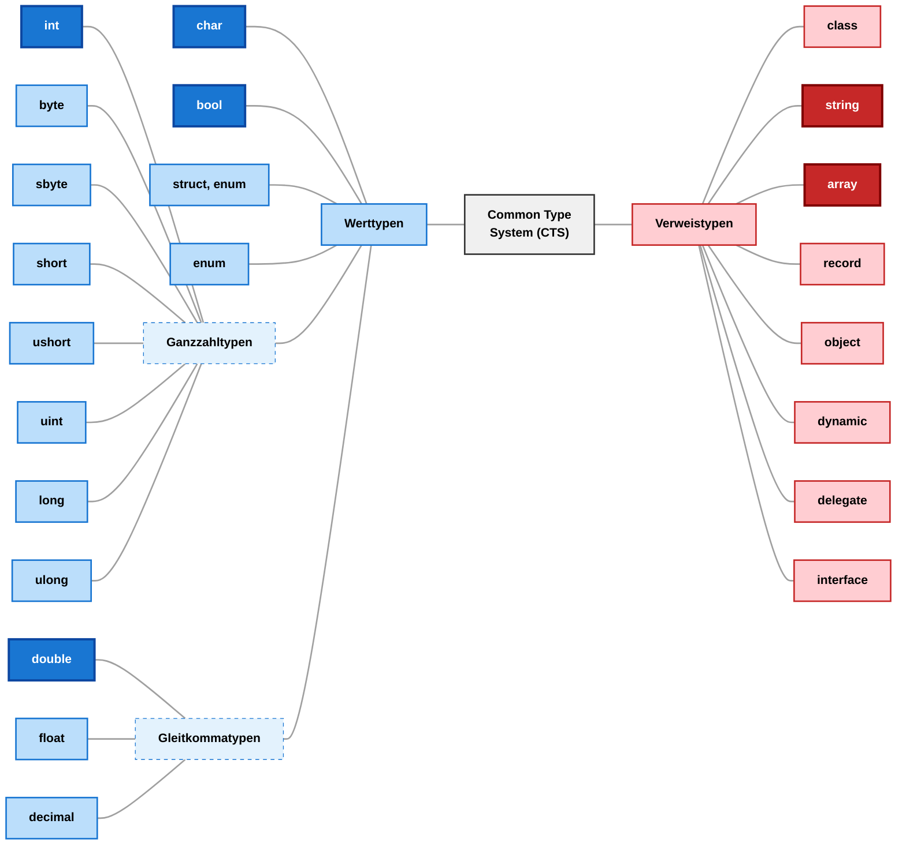
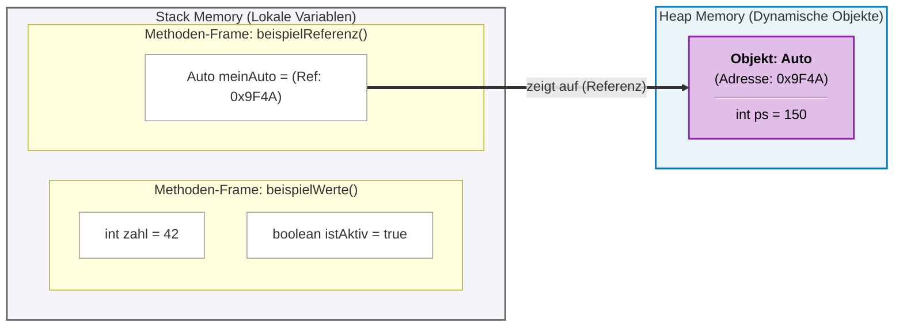
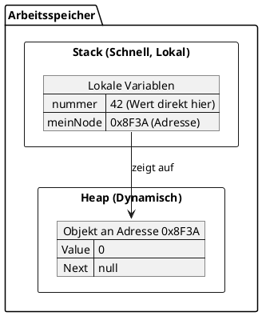

#### Welche Begriffe werden hier verwendet?
[``Bedingte Anweisung``](../../../05_Glossar.md#bedingte-anweisung), [``Bedingung``](../../../05_Glossar.md#bedingung), [``De Morgan'sches Gesetz``](../../../05_Glossar.md#de-morganschen-gesetz), [``early exit``](../../../05_Glossar.md#early-exit), [``Exception``](../../../05_Glossar.md#exception), [``Guard Clause``](../../../05_Glossar.md#guard-clause), [``Logische Operatoren``](../../../05_Glossar.md#logische-operatoren), [``negieren``](../../../05_Glossar.md#negieren), [``return``](../../../05_Glossar.md#return), [``throw``](../../../05_Glossar.md#throw), [``verschachtelte Verzweigung``](../../../05_Glossar.md#verschachtelte-verzweigung), [``Verzweigung``](../../../05_Glossar.md#verzweigung), [``Wahrheitstabelle``](../../../05_Glossar.md#wahrheitstabelle).

# Referenztypen, Werttypen und deren Semantik

Bevor wir uns ansehen, wie wir selbst ``Datenstrukturen`` wie eine `Linked List` programmieren, müssen wir verstehen, wie C# mit dem ``Arbeitsspeicher`` umgeht. Was ist ein ``Heap`` was ein ``Stack``? Was sind ``Variablen`` welche ``Referenzen`` oder ``Werte`` halten und was müssen wir beim Programmieren beachten? Ohne ein klares Verständnis von ``Referenzen`` werden uns ``verkettete Listen`` möglicherweise Probleme bereiten.

---

## Erste Definitionen

### Was sind Variablen die Werte halten?
Gehen wir zuerst noch auf eine Analogie für ``Variablen`` ein. Die ``Werte`` sind *Güter* in einem *Lager* und werden in einem *Regal* verwahrt. Dieses *Regal* ist die ``Variable``. Das *Regal* weiß *was* wir für *Güter* hineinlegen dürfen, besitzt ein *Etikett* damit wir es erkennen wenn wir davor stehen und hat zusätzlich eine *Wegbeschreibung* wo es sich im Lager befindet. Was *hineindarf* ist der ``Typ`` der ``Variable``, das *Etikett* ist der ``Name`` der ``Variable`` und die *Wegbeschreibung* ist die ``Speicheradresse`` der ``Variable``. 

Wir merken uns:
> ``Variablen`` welche ``Werttypen`` halten, können folgende Fragen beantworten:
> 1. Welcher ``Typ`` wurde mir bei der ``Deklaration`` mitgeteilt?
> 2. Unter welchem ``Namen`` kann ich verwendet werden?
> 3. Auf welcher ``Adresse`` befinde ich mich?
> 4. Was ist mein ``Wert`` der hinter der ``Adresse`` steht?

### Was sind Variablen die Referenzen halten?
Wir behandeln später *warum* wir ``Referenztypen`` benötigen und versuchen zuerst zu verstehen, was sie sind.

Wir wissen also ``Variablen`` sind *Platzhalter* für ``Werte`` gewisser ``Typen``. Wir brechen nun diesen *Merkspruch* ein wenig auf und unterscheiden zwischen ``Variablen`` welche *Platzhalter* für ``Referenzen`` gewisser ``Typen`` sind und jene die *Platzhalter* für ``Werten`` gewisser ``Typen`` sind.

Aber zuerst eine Übersicht welche ``Typen`` der Idee der ``Referenzen`` und jene der ``Werte`` zugeschrieben werden. Wir sehen wir kennen bereits ``Variablen`` aus beiden *Welten* und zwar jene mit *dunkel* eingefärbten ``Typen``.



Was ist nun aber eine ``Variable`` die ``Referenztypen`` beinhaltet? In der vorherigen *Analogie* welche für ``Werttypen`` gilt, liegen im *Regal* die *Güter*. Bei ``Referenztypen`` liegt im *Regal* eine **weitere** *Wegbeschreibung*. Diese *Wegbeschreibung* nennen wir ``Referenz``. Diese führt uns zu einem anderen *Regal* im *Lager*. Dieser *andere Ort* kann nun die *Güter* beinhalten.

Wir merken uns:
> Eine ``Referenz`` ist ein *Verweis* an einem anderen Ort im ``Arbeitsspeicher``.
> Eine ``Variable`` welche ``Werttypen`` zulässt, beinhaltet neben deren ``Speicheradresse`` die ``zugewiesenen`` *Daten* als ``Wert``.  
> Eine ``Variable`` welche ``Referenztypen`` zulässt, beinhaltet neben deren ``Speicheradresse`` eine *weitere* ``Speicheradresse`` als ``Wert``. Dieser müssen wir folgen um zu den *Daten* zu gelangen.

### Was sind Variablen die eine *null* Referenz halten?
Wir greifen wieder auf unsere Analogie eines *Lagers* zurück. Wir stehen vor einem *Regal*. Wir wissen, dass dieses *Regal* einen ``Referenztyp`` lagern kann und erwarten deshalb eine *Wegbeschreibung*. Wir finden jedoch einen *leeren* Zettel. Das bedeutet nun, dass wir nichts mehr tun können und müssen abbrechen. Warum das überhaupt notwendig ist, verschieben wir auch auf später.

Wenn wir nun eine ``Variable``, welche ``Referenztypen`` hält, fragen was ihr ``Wert`` ist und als Anwort eine *leere Wegbeschreibung* bekommen, hat diese ``Variable`` den ``Wert`` *null*. 

Wir merken uns:
>Eine ``Variable`` welche ``Referenztypen`` zulässt, kann eine *leere* ``Referenz`` als ``Wert`` halten. Der ``Wert`` dieser ``Variable`` wird mit *null* ausgewiesen.

### Was ist der Call-Stack und Managed-Heap im Arbeitsspeicher?
Wir unterteilen *logisch* den ``Arbeitsspeicher`` in einem ``Stack`` und einem ``Heap``. *Logisch* bedeutet hier, dass wir *physisch* ein ``Stack`` von einem ``Heap`` nicht ununterscheidbar im ``Arbeitsspeicher`` ist. Es sind Regeln die wir einführen. Die Art und Weise, wie ein Programm ``Variablen`` im ``Arbeitspeicher`` ablegt, gibt uns ein besseres Verständnis bei möglichen ``Fehlerbehandlungen`` und *Performance-Problemen*. Wir schauen uns hier ein paar ungefähre Daumenregeln.

#### Call-Stack
``Werttypen`` und dessen ``Scope`` werden im ``Call-Stack`` gespeichert. ``Stack`` bedeutet *Stapel* und ist im allgemeinen eine ``Datenstruktur`` wie ein ``Array``. Im ``Arbeitsspeicher`` heißt die *logische* Unterteilung ``Call-Stack``, weil dort die ``First-In-Last-Out`` Logik dieser ``Datenstruktur`` gilt. *Call* bedeutet *Aufrufen* und bildet die Idee ab, dass wir einen sich ändernden ``Scopes``, also die *Lebensdauer* von ``Variablen`` in eine ``Datenstruktur`` *effizient* abbilden. 

Ein Beispiel für folgendes Programm:
TODO animation stack heap. scope baut sich auf und ab am heap.

```csharp
static void Main() 
{
    int limit = 10;
    int userinput = int.parse(Console.Read());
    
    if (userintput < limit)
    {
        int doppelterUserinput = userinput * 2;
        Console.WriteLine(doppelterUserinput);
    }
}
```

Der ``Scope`` der ``Main-Methode`` wird auf den ``Stack`` gelegt wird. Heißt alle ``Variablen`` aus dem ``Block`` liegen dort auf *Ebene 0*. Weiter unten im Programm wird eine ``Zählschleife`` gestartet, welche einen neuen ``Block`` und damit ``Scope`` anlegt. Da dieser ``Scope`` nun ein anderer ist 


. Gleiches gilt für ``Funktionen``, ``Methoden``, etc. Alles was einen ``Scope`` hat wird auf den ``Stack`` gelegt und wenn dieser sich schließt indem der ``Block`` endet.


 endetwerden direkt dort gespeichert, wo sie deklariert werden. Wenn sie lokale Variablen in einer Methode sind, landen sie direkt auf dem Stack.

Wir merken uns:
> Scope

**Code-Snippet: Wertdaten**
```java
public void beispielWerte() {
    // Diese Werte landen direkt auf dem Stack im Bereich dieses Methodenaufrufs.
    int zahl = 42;
    boolean istAktiv = true;
}
```
*Erklärung:* Sobald die Methode `beispielWerte()` aufgerufen wird, reserviert das System einen kleinen Block auf dem Stack. Darin wird der Name `zahl` direkt mit dem Wert `42` und `istAktiv` mit dem Wert `true` hinterlegt. Wenn die Methode beendet ist, wird dieser Stack-Speicher sofort wieder freigegeben.

---

## 2. Referenzdaten (Objekte) und die Brücke zum Heap

Wenn wir komplexe Datentypen (Objekte) erstellen, kommen sowohl der Stack als auch der Heap zum Einsatz. Das eigentliche Objekt wird auf dem **Heap** (einem großen, dynamischen Speicherbereich) erstellt. Die lokale Variable auf dem **Stack** speichert lediglich die Speicheradresse (die Referenz), die auf dieses Objekt zeigt.

**Code-Snippet: Referenzdaten**
```java
class Auto {
    int ps = 150; // Primitive Eigenschaft, liegt INNERHALB des Objekts
}

public void beispielReferenz() {
    // 1. Stack: Die Variable 'meinAuto' wird angelegt.
    // 2. Heap: 'new Auto()' erstellt das Objekt.
    // 3. Verknüpfung: 'meinAuto' auf dem Stack speichert die Adresse des Objekts auf dem Heap.
    Auto meinAuto = new Auto();
}
```
*Erklärung:* Auf dem Stack wird Platz für `meinAuto` gemacht. Dort steht aber nicht das Auto selbst, sondern nur eine Referenz (z.B. eine Adresse wie `0x9F4A`). Das Schlüsselwort `new` sucht freien Platz auf dem Heap, baut dort das `Auto`-Objekt auf (mitsamt seiner `ps`-Eigenschaft direkt in diesem Block) und gibt die Adresse an den Stack zurück.

---

## Visualisierung: Stack vs. Heap

Das folgende Mermaid-Diagramm veranschaulicht den Speicherzustand, wenn beide obigen Methoden ausgeführt werden.



### Zusammenfassung des Diagramms:
*   **Im Stack** siehst du die direkten Werte (`42`, `true`).
*   **Im Stack** siehst du auch die Referenzvariable (`meinAuto`), aber ihr Inhalt ist nur eine Wegbeschreibung (`0x9F4A`).
*   **Im Heap** liegt das tatsächliche `Auto`-Objekt. Beachte, dass die primitive Eigenschaft `ps = 150` *im* Objekt auf dem Heap lebt, weil sie Teil der Objektstruktur ist.

---

#### Heap


## Werttyp-Semantik und Referenztyp-Semantik


Der fundamentale Unterschied zwischen einem Werttyp (int) und einem Verweistyp (Array) liegt in dem exakten Inhalt und der festen Speichergröße der Variable auf dem Stack.

Bei einer Ganzzahl-Deklaration wie int zahl = 42; reserviert das Programm auf dem Stack exakt 4 Byte (32 Bit). In genau diese 4 Byte wird der Binärcode für die Zahl 42 direkt hineingeschrieben. Die Variable enthält also zu 100 % den reinen Datenwert selbst und sonst nichts.

Bei einem Verweistyp wie int[] zahlen = new int[100]; speichert die Variable zahlen auf dem Stack keine einzige dieser 100 Zahlen. Sie speichert ausschließlich eine Speicheradresse (die Referenz), die als Wegweiser auf den Heap zeigt. Da eine Speicheradresse auf modernen 64-Bit-Betriebssystemen eine feste Länge hat, belegt die Referenz-Variable auf dem Stack immer exakt 8 Byte (64 Bit) – völlig unabhängig davon, ob das Array später 10, 100 oder 10.000 Elemente fasst.

Das eigentliche Array-Objekt mit den Nutzdaten befindet sich drüben im Heap. Seine Größe dort berechnet sich dynamisch aus der Anzahl der Elemente multipliziert mit der Größe ihres Datentyps, zuzüglich eines kleinen Overheads für interne Verwaltungsinformationen (wie beispielsweise die Eigenschaft .Length). Für das Konstrukt new int[100] werden im Heap also mindestens 400 Byte (100 Elemente × 4 Byte pro int) am Stück reserviert.

Zusammenfassend: Die 8 Byte kleine Referenz-Variable auf dem Stack fungiert lediglich als fixer Wegweiser zu dem 400 Byte großen, flexiblen Datenblock im Heap


## 1. Wertdaten (Primitive Datentypen) im Stack


## 2. Werttypen vs. Referenztypen & deren Semantik

In C# unterscheiden wir streng zwischen zwei Arten von Datentypen:

### Werttypen (Value Types)
Dazu gehören einfache Datentypen wie `int`, `double`, `bool` oder auch `struct`. 
* **Wert-Semantik:** Wenn du einen Werttyp an eine andere Variable zuweist (`a = b`), wird der **Wert kopiert**. Änderst du danach `a`, bleibt `b` davon unberührt. Jeder hat seine eigene unabhängige Kopie.

### Referenztypen (Reference Types)
Dazu gehören `class`, `string`, Arrays (`int[]`) und im Grunde alle komplexen Objekte.
* **Referenz-Semantik:** Wenn du einen Referenztyp zuweist (`objA = objB`), wird **nicht das Objekt kopiert**, sondern nur die *Adresse*. Beide Variablen zeigen nun auf dasselbe Objekt im Speicher. Änderst du `objA.Value`, ändert sich auch `objB.Value`, denn es ist dasselbe Haus, nur mit zwei verschiedenen Wegweisern!

---

## 3. Stack und Heap: Wo leben unsere Daten?

Um zu verstehen, warum sich Wert- und Referenztypen so verhalten, müssen wir in den ``Arbeitsspeicher`` (RAM) schauen. Dieser wird vom Programm grob in zwei Bereiche aufgeteilt: den **Stack** (Stapelspeicher) und den **Heap** (Halden- oder Freispeicher).

* **Der Stack:** Hier landen alle lokalen Variablen und Methodenaufrufe. Der Stack ist extrem schnell, aufgeräumt und arbeitet nach dem LIFO-Prinzip (Last In, First Out). **Werttypen** werden direkt hier mit ihrem echten Wert gespeichert. Bei **Referenztypen** liegt hier nur die *Referenz* (die Adresse).
* **Der Heap:** Das ist der große, dynamische Speicherbereich. Hier werden alle Objekte (Instanzen von Klassen) gespeichert, wenn wir das Schlüsselwort `new` verwenden. 

Hier ist ein Diagramm, das verdeutlicht, was bei folgendem Code im Speicher passiert:

```csharp
int nummer = 42; 
Node meinNode = new Node();
```



Wie du siehst: Der `int`-Wert liegt direkt auf dem Stack. Das `Node`-Objekt liegt auf dem Heap, und auf dem Stack liegt nur die Adresse (`0x8F3A`), die dorthin zeigt.

---

## 4. Garbage Collection: Wer räumt den Heap auf?

Wenn wir mit `new` andauernd neue Objekte auf dem Heap erstellen, wäre der Speicher irgendwann voll. In Sprachen wie C oder C++ müssen Programmierer diesen Speicher manuell wieder freigeben. 

C# nimmt uns diese Arbeit ab: durch den **Garbage Collector (GC)** (Müllabfuhr). 
* **Wie funktioniert er?** Der GC überprüft regelmäßig den Stack und verfolgt alle aktiven Referenzen. Findet er Objekte auf dem Heap, auf die *keine* einzige Referenz mehr zeigt (die also unerreichbar geworden sind), markiert er sie als "Müll" und gibt den Speicherplatz automatisch wieder frei. ✅

---


## Wert- und Referenzdaten - ein erster Eindruck


In .NET wird jede Variable entweder als **Werttyp** oder als **Referenztyp** klassifiziert. Der Hauptunterschied liegt darin, **wie das Verhalten bei einer Methodenübergabe stattfindet**. Darauf liegt unser Fokus. Es ist **nicht** eindeutig **wo die Daten gespeichert werden**. Der Compiler entscheidet autonom über den Ort der Variablen im Speicher (Heap, Stack, Register, ...). Es gibt jedoch ein paar Daumenregeln, welche wir uns anschauen werden. 

**Anmerkung:** Wir gehen auch nicht auf Details von Referenzen ein, ebenso wenig wie auf Pointer und arbeiten mit einem vereinfachten, technisch nicht korrekten Konzept. Eine Analogie wäre das gelehrte Bohr'sche Modell von Atomen in Schulen vs. Quantenmechanik. Für besonders Interessierte, [hier](TODO) eine **optionale** hardwarenähere und korrektere Betrachtung von Refernzen, Values und Pointer für besonders Interessierte.

---

* **Werttypen (Value Types)**: Speichern ihre Daten direkt an ihrem Speicherort. Wenn eine Werttyp-Variable einer anderen zugewiesen wird, wird der **Wert kopiert**. Sie leben in der Regel auf dem **Stack**, einem schnellen Speicherbereich für lokale Variablen und Methodenaufrufe. Beispiele: `int`, `double`, `bool`, `char`, `struct`, `enum`.

* **Referenztypen (Reference Types)**: Speichern nicht die Daten selbst, sondern eine **Referenz (einen Zeiger)** auf den Speicherort der Daten. Die eigentlichen Daten (das Objekt) liegen auf dem **Heap**, einem größeren, aber unorganisierten Speicherbereich. Wenn eine Referenztyp-Variable einer anderen zugewiesen wird, wird nur die **Referenz kopiert**, nicht das Objekt selbst. Beide Variablen zeigen danach auf dasselbe Objekt. Beispiele: `class`, `string`, `object`, `array`, `delegate`. Achtung! string hat ein spezielles Verhalten welches, manchmal das **Verhalten** eines ``Wertdatentyps`` hat und manchmal eines ``Referenzdatentyps`` hat. 

### Übergabe an Methoden
* **Wertdatensemantik**: Wenn ein Werttyp an eine Methode übergeben wird, wird eine **Kopie** des Wertes erstellt und an den Methodenparameter übergeben. Änderungen am Parameter innerhalb der Methode haben **keine Auswirkungen** auf die ursprüngliche Variable außerhalb der Methode.

```csharp
void Increment(int number)
{
    number = number + 1; // Ändert nur die lokale Kopie
}

int myValue = 5;
Increment(myValue);
// myValue ist immer noch 5!
```

* **Referenzdatensemantik**: Wenn ein Referenztyp übergeben wird, wird die **Referenz kopiert**. Beide Referenzen (die originale und die im Parameter) zeigen auf **dasselbe Objekt** auf dem Heap. Änderungen am Objekt über den Parameter sind daher auch außerhalb der Methode sichtbar. 

```csharp
class MyData { public int Value { get; set; } }

void ChangeValue(MyData data)
{
    data.Value = 99; // Ändert das Objekt, auf das beide Referenzen zeigen
}

var myData = new MyData { Value = 5 };
ChangeValue(myData);
// myData.Value ist jetzt 99!
```

### Die Schlüsselwörter `ref` und `out`

Um die Wertdatensemantik zu umgehen und eine Methode zu erlauben, einen Werttyp direkt zu modifizieren, gibt es `ref` und `out`. Sie übergeben quasi die "Adresse" des Werttyps an die Methode.

* `ref`: Der Parameter wird als Referenz übergeben. Die Variable muss **vor dem Aufruf initialisiert** worden sein.
* `out`: Ähnlich wie `ref`, aber die Variable muss **nicht initialisiert** sein. Die Methode **verpflichtet sich**, dem Parameter vor dem Verlassen einen Wert zuzuweisen.

```csharp
void ChangeByRef(ref int number)
{
    number = number + 1;
}

void GetValue(out int result)
{
    result = 100; // Muss hier zugewiesen werden
}

int val = 5;
ChangeByRef(ref val);
// val ist jetzt 6.

int outVal;
GetValue(out outVal);
// outVal ist jetzt 100.
```

### Tiefe vs. Flache Kopien

Da bei Referenztypen nur die Referenz kopiert wird, spricht man von einer **flachen Kopie (Shallow Copy)**. Wenn ein Objekt selbst Referenztypen enthält (z.B. eine `Person`-Klasse mit einer `Address`-Klasse), wird es kompliziert. Eine flache Kopie der `Person` würde eine neue `Person` erstellen, aber deren `Address`-Feld würde immer noch auf dasselbe `Address`-Objekt zeigen.

Eine **tiefe Kopie (Deep Copy)** bedeutet, dass nicht nur das Objekt, sondern auch alle Objekte, auf die es verweist, rekursiv kopiert werden. Dies wird oft über einen **Copy Constructor** implementiert.

```csharp
public class Address
{
    public string Street { get; set; }
}

public class Person
{
    public string Name { get; set; }
    public Address Address { get; set; }

    // Normaler Konstruktor
    public Person(string name, Address address)
    {
        Name = name;
        Address = address;
    }

    // Copy Constructor für eine tiefe Kopie
    public Person(Person other)
    {
        Name = other.Name;
        // Erstellt ein neues Address-Objekt, anstatt nur die Referenz zu kopieren
        Address = new Address { Street = other.Address.Street };
    }
}

var originalAddress = new Address { Street = "Main St 1" };
var john = new Person("John", originalAddress);

// Tiefe Kopie mit dem Copy Constructor
var johnsClone = new Person(john);

// Ändern der Adresse des Klons
johnsClone.Address.Street = "Second St 2";

// Johns Adresse bleibt unverändert, da es eine tiefe Kopie war.
Console.WriteLine(john.Address.Street); // Gibt "Main St 1" aus
```

---

## Klassen vs. Structs

* **Klassen (`class`)**: Sind Referenztypen. Unterstützen Vererbung (eine Klasse kann von einer anderen erben, "ist eine"-Beziehung). Können `null` sein.
* **Structs (`struct`)**: Sind Werttypen. Unterstützen keine Vererbung (können aber Interfaces implementieren). Können nicht `null` sein (außer sie sind `Nullable<T>`). Sie sind ideal für kleine, datenorientierte Strukturen, bei denen die Kopier-Semantik erwünscht ist (z.B. `Point`, `Color`).

**Beispielhafter Unterschied bei der Zuweisung:**

```csharp
public class PointClass { public int X, Y; }
public struct PointStruct { public int X, Y; }

// Klasse (Referenztyp)
PointClass p1_class = new PointClass { X = 10, Y = 20 };
PointClass p2_class = p1_class; // Kopiert die Referenz
p2_class.X = 100;
// p1_class.X ist jetzt auch 100, da beide auf dasselbe Objekt zeigen.

// Struct (Werttyp)
PointStruct p1_struct = new PointStruct { X = 10, Y = 20 };
PointStruct p2_struct = p1_struct; // Kopiert den gesamten Wert
p2_struct.X = 100;
// p1_struct.X ist immer noch 10, da es eine unabhängige Kopie ist.
```

---

## Nullable und Null-Coalescing

### Nullable-Werttypen (`?`)

Standardmäßig kann ein Werttyp wie `int` nicht `null` sein. In vielen Szenarien (z.B. Datenbanken, Web-APIs) muss ein Wert jedoch optional sein. Hierfür gibt es `Nullable<T>`, was durch ein `?` nach dem Typ abgekürzt wird.

`int?` ist also nur syntaktischer Zucker für `System.Nullable<int>`. Diese Struct hat zwei wichtige Properties:
* `HasValue` (bool): `true`, wenn ein Wert vorhanden ist.
* `Value` (T): Gibt den Wert zurück. Löst eine Exception aus, wenn `HasValue` `false` ist.

**Was der Compiler daraus macht:**

```csharp
// Dein Code:
int? optionalId = null;
if (optionalId.HasValue)
{
    Console.WriteLine($"ID ist: {optionalId.Value}");
}
```

### Null-Coalescing Operator (`??`)

Der `??`-Operator ist eine Kurzform, um einen Standardwert bereitzustellen, falls eine Variable `null` ist.

**Was der Compiler daraus macht:**

```csharp
// Dein Code:
int? optionalId = null;
int id = optionalId ?? -1; // Wenn optionalId null ist, nimm -1, sonst den Wert.

// Ausgeschriebener Code:
int id;
if (optionalId.HasValue)
{
    id = optionalId.Value;
}
else
{
    id = -1;
}
// Oder mit dem ternären Operator:
int id = optionalId.HasValue ? optionalId.Value : -1;
```

### Nullable-Referenztypen

Seit C# 8 gibt es auch Nullable-Referenztypen. Hier ist das `?` (z.B. `string?`) ein **Hinweis an den Compiler** für die statische Code-Analyse. Es ändert nichts am Laufzeitverhalten (ein `string` konnte schon immer `null` sein), aber der Compiler warnt dich nun, wenn du versuchst, eine potenziell `null`-Referenz zu verwenden, ohne sie vorher zu prüfen.

### Warum in Web-Programmierung & EF Core?

* **Web-APIs (z.B. JSON)**: Ein Client sendet möglicherweise ein JSON-Objekt, in dem ein Feld fehlt. Beim Deserialisieren in ein C#-Objekt wird dieses Feld `null`. Wenn das zugehörige Property ein `int?` ist, funktioniert das. Wäre es ein `int`, würde es zu einem Fehler kommen.
* **Entity Framework Core (Datenbanken)**: Eine Spalte in einer Datenbanktabelle kann als `NULL` deklariert sein (z.B. `INT seriennummer NULL`). EF Core mappt dies automatisch auf ein Nullable-Property in der C#-Entitätsklasse, z.B. `public int? Seriennummer { get; set; }`.

---

## Records vs. Classes

**Records** sind eine spezielle Art von Referenztyp (oder `struct` mit `record struct`), die für die Speicherung von unveränderlichen (immutable) Daten optimiert sind.

* **Mutability**: Klassen sind standardmäßig **veränderlich (mutable)**. Ihre Properties können nach der Erstellung des Objekts geändert werden. Records sind standardmäßig **unveränderlich (immutable)**. Einmal erstellt, können ihre Werte nicht mehr geändert werden. Man erstellt stattdessen eine neue, modifizierte Kopie mit dem `with`-Ausdruck.
* **Wert-Gleichheit**: Records implementieren automatisch Wert-Gleichheit. Zwei Record-Instanzen gelten als gleich, wenn alle ihre Properties die gleichen Werte haben. Zwei Klassen-Instanzen gelten nur als gleich, wenn sie auf dasselbe Objekt im Speicher verweisen (Referenz-Gleichheit), es sei denn, `Equals` wird manuell überschrieben.

**Automatisch implementierte Methoden bei Records:**
* Ein Konstruktor, der alle Properties entgegennimmt.
* `ToString()`: Gibt eine saubere, lesbare Darstellung aller Properties aus.
* `Equals()` und `GetHashCode()`: Basierend auf den Werten aller Properties.
* `==` und `!=` Operatoren: Basierend auf `Equals()`.
* Ein "Deconstructor", der die Properties in einzelne Variablen zerlegen kann.

```csharp
// Klassische, veränderliche Klasse
public class PersonClass
{
    public string FirstName { get; set; }
    public string LastName { get; set; }
}

// Unveränderlicher Record (Kurzschreibweise)
public record PersonRecord(string FirstName, string LastName);

// --- Verwendung ---

var personA = new PersonClass { FirstName = "John", LastName = "Doe" };
var personB = new PersonClass { FirstName = "John", LastName = "Doe" };
Console.WriteLine(personA == personB); // False (verschiedene Objekte)

var recordA = new PersonRecord("John", "Doe");
var recordB = new PersonRecord("John", "Doe");
Console.WriteLine(recordA == recordB); // True (gleiche Werte)

// Unveränderlichkeit mit `with`
var recordC = recordA with { FirstName = "Jane" };
Console.WriteLine(recordA); // Gibt PersonRecord { FirstName = John, LastName = Doe } aus
Console.WriteLine(recordC); // Gibt PersonRecord { FirstName = Jane, LastName = Doe } aus
```

---

## static vs. non-static Variablen

Statische Variablen gehören zur Klasse selbst, nicht zu einer einzelnen Instanz.

* **Existenz:** Sie existieren genau einmal pro Anwendung, sobald das Programm die Klasse "kennt". Es ist egal, ob Sie 0, 1 oder 1.000 Objekte dieser Klasse erstellen.
* **Speicher:** Es gibt nur **eine einzige Kopie** dieser Variable im Speicher, die von allen Instanzen geteilt wird.
* **Zugriff:** Sie werden direkt über den Klassennamen aufgerufen (z.B. `Auto.anzahlProduzierterAutos`). Man braucht kein Objekt dafür.

**Beispiel:**

```csharp
public class Auto
{
    // Non-Static / Instanzvariable
    public string farbe;

    // Static Variable
    // Diese eine Variable wird von allen Auto-Objekten geteilt.
    public static int anzahlProduzierterAutos = 0;

    public Auto(string farbe)
    {
        this.farbe = farbe;
        
        // Jedes Mal, wenn ein neues Auto erstellt wird (der Konstruktor aufgerufen wird),
        // erhöhen wir den EINEN zentralen Zähler.
        Auto.anzahlProduzierterAutos++;
    }
}

public class Programm
{
    public static void Main()
    {
        // Zugriff auf die statische Variable, OBWOHL es noch kein Auto-Objekt gibt.
        Console.WriteLine($"Bisher produzierte Autos: {Auto.anzahlProduzierterAutos}"); // Gibt 0 aus

        Auto meinBmw = new Auto("Blau");
        Auto deinVw = new Auto("Rot");
        
        // Der Zähler wurde zweimal erhöht.
        Console.WriteLine($"Jetzt produzierte Autos: {Auto.anzahlProduzierterAutos}"); // Gibt 2 aus
    }
}
```

### Wann verwende ich was?
* **Verwende `non-static` (Standardfall):**
    Für alle Daten, die ein individuelles Objekt ausmachen. Wenn Sie sich fragen: "Hat jedes Objekt seinen eigenen, einzigartigen Wert für diese Eigenschaft?", dann ist es non-static. Dies trifft auf über 95% aller Variablen zu.

* **Verwende `static` (Sonderfall):**
    * **Zähler:** Wie im Beispiel `anzahlProduzierterAutos`, um zu verfolgen, wie viele Objekte erstellt wurden.
    * **Konstanten oder feste Werte:** `public static readonly double PI = 3.14159;`. Da Pi immer gleich ist, braucht nicht jedes Objekt eine eigene Kopie.
    * **Geteilte Ressourcen oder Konfiguration:** Ein `static` Feld kann eine Datenbankverbindung oder einen Konfigurationswert halten, auf den alle Instanzen zugreifen müssen.
    * **Utility-Funktionen:** Statische Methoden (die oft mit statischen Variablen arbeiten) benötigen kein Objekt, um aufgerufen zu werden (z.B. `Math.Max(5, 10)`).


### static vs. non-static bei Strings und Speicher
Dieses Beispiel analysiert den Speicherverbrauch basierend darauf, wie ein `string`-Feld in einer Klasse deklariert wird, wenn Millionen von Instanzen erstellt werden. `string` ist ein besonderer Referenztyp, da er unveränderlich ist und der Compiler eine Technik namens **String Interning** anwendet.

Das wesentliche was wir hier sehen sollen ist, ``static string darstellung = "🐹";`` relaubt uns die Vermeidung von vielen eigenen *string* (``Referenz``) ``Variablen``, die doppelt im Speicher liegen ``string darstellung = new string("🐹");``. Zusätzlich ist es bei *string* aber so, wenn die Symbole dem Compiler bereits bekannt sind, also ``string darstellung = "🐹";``, dass wir ``String Interning`` verwenden. Quasi ein Pool an Strings der für uns das ```Flyweight Pattern`` implementiert (dazu später). Das bedeutet wir schreiben nichts doppelt in den Speicher, auch ohne ``static``. Für allgemeine Objekte gilt das nicht! Ist nur eine Ausnahme für *strings*.

```csharp
using System.Diagnostics;
using System.Text;

// Beginne hier zu lesen!
public class Programm
{
    public class Hamster
    {
        // Version 1: Ein einziges statisches Feld für alle Hamster.
        // Geringster Speicherverbrauch. Nur ein String-Objekt existiert.
        static string darstellung_static = "🐹";

        // Version 2: Instanzfeld mit einem Literal.
        // Der Compiler "interned" den String "🐹". Alle Instanzen teilen sich
        // eine Referenz auf dasselbe String-Objekt im Speicher (im String Intern Pool).
        // Sehr speichereffizient. Der Mehraufwand ist nur ein Referenz-Pointer pro Hamster-Objekt.
        // string darstellung_instance_interned = "🐹";
        
        // Version 3: Explizites Erstellen eines neuen Strings.
        // Dies kann den Interning-Mechanismus umgehen und potenziell für jede
        // Instanz ein neues String-Objekt auf dem Heap erstellen.
        // Speicher-GAU: 100 Mio. Hamster-Objekte + 100 Mio. String-Objekte.
        // (Hinweis: Der JIT-Compiler kann dies manchmal trotzdem optimieren).
        // string darsellung_instance_new = new string('🐹', 1);

        // Version 4: Leere Klasse.
        // Dient als Basiswert, um den reinen Overhead der Hamster-Objekte zu messen.
    }

    static void Main(string[] args)
    {
        // Beende hier zu lesen!
        Console.OutputEncoding = Encoding.UTF8;

        Console.WriteLine("Drücke Enter zum Starten...");
        Console.ReadLine();

        long memoryBefore = GC.GetTotalMemory(true);

        // Beginne hier zu lesen!
        var hamsters = new List<Hamster>();
        for (int i = 0; i < 100_000_000; i++)
        {
            hamsters.Add(new Hamster());
        }

        // Beende hier zu lesen!
        long memoryAfter = GC.GetTotalMemory(true);
        long memoryUsedByGC = memoryAfter - memoryBefore;

        Console.WriteLine($"Ungefährer Speicherverbrauch (GC.GetTotalMemory): {memoryUsedByGC / (1024.0 * 1024.0):F2} MB");

        GC.KeepAlive(hamsters); // Verhindert, dass der GC die Objekte zu früh abräumt.
    }
}
```
**Zusammenfassung der Ergebnisse (ungefähre Werte):**
* **Version 4 (leere Klasse):** ca. 2,2 GB. Dies ist der Overhead für 100 Mio. leere Objekte und die `List`-Struktur.
* **Version 1 (static):** Kaum ein Unterschied zu Version 4. Das eine statische String-Objekt fällt nicht ins Gewicht.
* **Version 2 (interned):** ca. 2,9 GB. Der zusätzliche Speicher (ca. 700-800 MB) ist für die 100 Mio. Referenzen (Pointer, je 8 Bytes auf einem 64-Bit-System) auf das *eine* internierte String-Objekt.
* **Version 3 (new string):** > 4,5 GB. Hier sehen wir den massiven Mehraufwand, da für (fast) jeden Hamster ein eigenes String-Objekt auf dem Heap angelegt wird.

---

### Flyweight Pattern

#### Das Problem
Stellen wir uns vor, wir haben Millionen von Objekten (z.B. `Hamster`), die eine Eigenschaft haben (z.B. `Darstellung`), welche aber nur eine kleine, feste Anzahl von Zuständen annehmen kann (z.B. ``"🐹", "🧱", "🌍"``). Wenn wir für jeden Hamster ein neues `Darstellung`-Objekt erstellen, verschwenden wir enorm viel Speicher, da wir tausendfach identische Daten duplizieren. Der Unterschied zum vorherigen Problem ist, dass wir nicht eine fixe Darstellung haben, sondern eien Auswahl an mehreren haben. 

**Wichtig!** Um das ``String Interning`` zu umgehen schreiben wir nicht ``string Normal = "🐹";``, sondern ``HamsterDarstellung Normal = new("🐹");``. Das simuliert *strings* aus der Datenbank, oder welche neu von den Benutzern über eine website/console eingegeben werden.

#### Version 1 - einfach static verwenden für bekannte Darstellung
Zuerst jedoch hier eine Lösung welche einfach ``static`` verwendet. Das können wir tun, wenn wir wissen welche Symbole der Hamster haben wird (z.B. ``"🐹", "🧱", "🌍"``).

```csharp
// Die Klasse, die die geteilten, unveränderlichen Zustände enthält.
public class HamsterDarstellung
{
    public string Symbol { get; }

    // Privater Konstruktor, damit niemand neue Instanzen erstellen kann.
    private HamsterDarstellung(string symbol) { Symbol = symbol; }

    // Die vordefinierten, gemeinsam genutzten Instanzen.
    public static readonly HamsterDarstellung Normal = new("🐹");
    public static readonly HamsterDarstellung Hungrig = new("🍔");
    public static readonly HamsterDarstellung Muede = new("😴");
    public static readonly HamsterDarstellung Verliebt = new("❤️");
}

// Die Hamster-Klasse (der "Context")
public class Hamster
{
    // Die Instanzvariable, die auf eine der statischen Instanzen verweist.
    public HamsterDarstellung Darstellung { get; set; }
}

public class StaticExample
{
    public static void Main()
    {
        // Erstellen von Hamstern und Zuweisen der geteilten Zustände.
        var hamster1 = new Hamster { Darstellung = HamsterDarstellung.Normal };
        var hamster2 = new Hamster { Darstellung = HamsterDarstellung.Hungrig };
        var hamster3 = new Hamster { Darstellung = HamsterDarstellung.Normal }; // Verwendet dasselbe Objekt wie hamster1

        // Speicher wird gespart, weil nur die 4 statischen Objekte + 3 Hamster-Objekte existieren.
        // Die Referenz von hamster1.Darstellung und hamster3.Darstellung ist identisch.
        Console.WriteLine(object.ReferenceEquals(hamster1.Darstellung, hamster3.Darstellung)); // Gibt "True" aus
    }
}
```

### Version 2: das wirkliche Flyweight Pattern für unbekannte Darstellungen
Das **Flyweight Pattern** löst das Problem wenn wir nicht wissen welche Symbole ein Hamster haben wird, jedoch diesen nich 1000 mal speichern wollen. Wir schafen das indem es die gemeinsamen, unveränderlichen Daten (den *intrinsischen Zustand*) in "Flyweight"-Objekten auslagert. Eine **Factory** stellt sicher, dass für jeden einzigartigen Zustand **nur eine einzige Instanz** des Flyweight-Objekts existiert. Die individuellen Objekte (die `Hamster`) speichern dann nur noch eine Referenz auf das passende, geteilte Flyweight-Objekt.

**Implementierung basierend auf dem Beispiel:**
Wir erstellen eine `DarstellungFactory`, die uns Flyweight-Objekte für unsere Hamster-Darstellungen liefert.

```csharp
using System.Text;
using System.Linq;
using System.Collections.Generic;

// Das Flyweight-Objekt. Es enthält den geteilten, unveränderlichen Zustand.
public class HamsterDarstellung
{
    public string Symbol { get; } // Unveränderlich

    public HamsterDarstellung(string symbol)
    {
        Symbol = symbol;
        Console.WriteLine($"--> Neues Flyweight-Objekt für '{Symbol}' erstellt.");
    }
}

// Die Factory, die die Flyweights verwaltet und wiederverwendet.
public class DarstellungFactory
{
    private Dictionary<string, HamsterDarstellung> _flyweights = new();

    public HamsterDarstellung GetDarstellung(string symbol)
    {
        // Prüfen, ob schon ein Flyweight für dieses Symbol existiert.
        if (!_flyweights.ContainsKey(symbol))
        {
            // Wenn nicht, ein neues erstellen und im Pool speichern.
            _flyweights[symbol] = new HamsterDarstellung(symbol);
        }
        
        // Das (ggf. neue oder bereits existierende) Flyweight zurückgeben.
        return _flyweights[symbol];
    }
}

// Der "Context", der das Flyweight verwendet.
public class Hamster
{
    // Hält nur eine Referenz auf das geteilte Flyweight-Objekt.
    public HamsterDarstellung Darstellung { get; set; }
}

public class FlyweightExample
{
    static void Main(string[] args)
    {
        Console.OutputEncoding = Encoding.UTF8;

        var factory = new DarstellungFactory();
        var hamsters = new List<Hamster>();

        // Erstelle viele Hamster, wir simulieren hier unbekannte symbole aus der Datenbank.
        string[] symbols = { "🐹", "🧱", "🌍" }; // wichitg wir wissen nicht das es nur die 3 sein können! Wir wollen aber nicht 1000 Symbole händisch vom user eingeben lassen.
        var random = new Random();

        for (int i = 0; i < 10; i++)
        {
            string randomSymbol = symbols[random.Next(symbols.Length)];
            hamsters.Add(new Hamster
            {
                // Die Factory sorgt dafür, dass wir Objekte wiederverwenden!
                Darstellung = factory.GetDarstellung(randomSymbol)
            });
        }
        
        Console.WriteLine("\n--- Hamster-Liste ---");
        foreach(var hamster in hamsters)
        {
            Console.Write(hamster.Darstellung.Symbol);
        }
        Console.WriteLine();
    }
}
```
**Ergebnis der Ausführung:**
Der Konstruktor von `HamsterDarstellung` wird maximal 3-mal aufgerufen, egal wie viele Hamster erstellt werden. Alle Hamster mit demselben Symbol teilen sich dieselbe `HamsterDarstellung`-Instanz, was den Speicherverbrauch drastisch reduziert.
