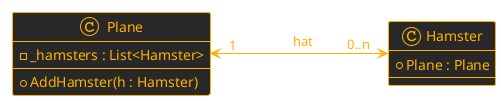
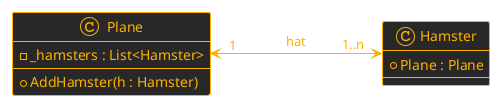

**Zettelübung: Beziehungen – Klassenebene vs. Objektebene**

**Name:** Musterlösung
**Datum:** 25.09.2026

**Klassendiagramm**
Gegeben ist das folgende Klassendiagramm. Es zeigt eine bidirektionale 1-zu-n-Beziehung zwischen einer `Plane` und vielen `Hamstern`.



---

**Übung 1: Code-Analyse – Klassenebene oder Objektebene?**

#### Variante A:
```csharp
public class Plane 
{
    private List<Hamster> _hamsters = new List<Hamster>();

    public void AddHamster(Hamster hamster) 
    {
        _hamsters.Add(hamster);
    }
}

public class Hamster 
{
    public Plane Plane { get; set; }
}
```
**Klassenebene bidirektional?**&emsp;&emsp;&emsp;✅ Ja  🔲 Nein
**Objektebene bidirektional?**&emsp;&emsp;&emsp;&nbsp;🔲 Ja  ✅ Nein
**Mutiplizität *immer* eingehalten?**&emsp;🔲 Ja  ✅ Nein
**Begründung:**
**Klassenebene**: Ja, da beide ``Klassen`` den Code besitzen welcher die *Möglichkeit* bietet eine ``bidirektionale Assoziation`` umzusetzen. Das bedeutet die ``Eigenschaften``/``Felder`` sind ``definiert``. 
**Objektebene**: Nein, `AddHamster` fügt den Hamster zwar der Liste hinzu, vergisst aber, dem Hamster die Plane zuzuweisen (*hamster.Plane = this;* fehlt). 
**Mutiplizität immer erfüllt** Die ``Multiplizität`` (*Hamster hat 1 Plane*) wird nicht erzwungen, da ein Hamster mit *Plane = null* existieren kann.

#### Variante B:
```csharp
public class Plane 
{
    public void AddHamster(Hamster hamster) 
    {
        hamster.Plane = this;
    }
}

public class Hamster 
{
    public Plane Plane { get; set; }
}
```
**Klassenebene bidirektional?**&emsp;&emsp;&emsp;🔲 Ja  ✅ Nein
**Objektebene bidirektional?**&emsp;&emsp;&emsp;&nbsp;🔲 Ja  ✅ Nein
**Mutiplizität *immer* eingehalten?**&emsp;🔲 Ja  ✅ Nein
**Begründung:**
**Klassenebene:** Nein, der `Plane` fehlt das Feld (*List< Hamster >*), um sich die ``Objekte`` der ``Klasse`` *Hamster* zu merken.
**Objektebene:** Nein, da die *Plane* keine ``Liste`` hat, kann sie die *Hamster* nicht speichern. 
**Mutiplizität immer erfüllt** ``Multiplizität`` ist ebenfalls nicht mit dem ``Konstruktor`` *garantiert*.

#### Variante C:
```csharp
public class Plane 
{
    private List<Hamster> _hamsters = new List<Hamster>();

    public void AddHamster(Hamster hamster) 
    {
        _hamsters.Add(hamster);
        hamster.Plane = this;
    }
}

public class Hamster 
{
    public Plane Plane { get; set; }
}
```
**Klassenebene bidirektional?**&emsp;&emsp;&emsp;✅ Ja  🔲 Nein
**Objektebene bidirektional?**&emsp;&emsp;&emsp;&nbsp;✅ Ja  🔲 Nein
**Mutiplizität *immer* eingehalten?**&emsp;🔲 Ja  ✅ Nein
**Begründung:**
**Klassenebene:** Ja, beide kennen sich strukturell.
**Objektebene:** Ja, *AddHamster* verknüpft beide ``Objekte`` korrekt gegenseitig (``bidirektional``). 
**Multiplizität:** Nein. Es kann weiterhin *new Hamster()* aufrufen, ohne ein ``Objekt`` der ``Klasse`` *Plane* zuzuweisen. Dadurch hat der *Hamster* keine *Plane*, was die strikte "1"-``Multiplizität`` verletzt.

#### Variante D:
```csharp
public class Plane 
{
    public List<Hamster> Hamsters { get; } = new List<Hamster>();

    public Plane() 
    { 
    } 

    public Plane(Hamster hamster) 
    { 
        AddHamster(hamster) 
    } 

    public void AddHamster(Hamster hamster) 
    {
        _hamsters.Add(hamster);
        h.Plane = this;
    }
}

public class Hamster 
{
    public Plane Plane { get; set; } 
    
    public Hamster(Plane plane) 
    {
        Plane = plane;
        Plane.Hamsters.Add(this); 
    }
}
```
**Klassenebene bidirektional?**&emsp;&emsp;&emsp;✅ Ja  🔲 Nein
**Objektebene bidirektional?**&emsp;&emsp;&emsp;&nbsp;✅ Ja  🔲 Nein
**Mutiplizität *immer* eingehalten?**&emsp;✅ Ja  🔲 Nein
**Begründung:**
Multiplizität ist hier garantiert: Der ``Konstruktor`` im *Hamster* erfordert zwingend eine *Plane*. Man kann keinen *Hamster* ohne *Plane* erschaffen. Die ``bidirektionale`` ``Assoziation`` auf Ebene der ``Objekte`` passiert direkt im ``Konstruktor``.

___ 

**Übung - freiwillig:**



* **Was ist anders im `Klassendiagramm`?**
  Die ``Multiplizität`` auf Seiten des *Hamsters* hat sich von `"0..n"` auf `"1..n"` geändert. Das bedeutet, eine *Plane* ***muss*** von Anfang an mindestens einen *Hamster* besitzen.

* **Was entsteht hier für ein Problem wenn wir in den `Konstruktoren` *public Hamster(Plane plane)* und *public Plane(Hamster hamster)* haben?**
  Es entsteht ein *Henne-Ei-Problem* (``Zirkuläre Abhängigkeit`` bei der ``Instanziierung`` der ``Klassen`` durch den ``Konstruktor``). Um die *Plane* zu erstellen, braucht man einen existierenden *Hamster*. Um einen *Hamster* zu erstellen, braucht man eine existierende *Plane*. Beide fordern das jeweils andere ``Objekt`` an, bevor sie selbst existieren können.

* **Lies den Code durch welches dieses Problem löst und *vollziehe nach* warum es funktioniert.**
```csharp
public class Plane
{
    public HashSet<Hamster> Hamsters { get; set; } = new HashSet<Hamster>();

    private Plane() { }

    public void AddHamster(Hamster hamster)
    {
        if (Hamsters.Add(hamster))
        {
            hamster.Plane = this;
        }
    }

    public static (Plane, Hamster) CreatePlaneWithOneHamster()
    {
        Plane p = new Plane();
        Hamster h = new Hamster(p);
        return (p, h);
    }
}

public class Hamster
{
    public Plane Plane
    {
        get { return field; }
        set
        {
            field = value;
            field.AddHamster(this);
        }
    }

    public Hamster(Plane plane)
    {
        Plane = plane;
    }
}
```

Die Lösung nutzt das ``Factory-Method-Design-Pattern`` (``Methode`` *CreatePlaneWithOneHamster*). Der ``Konstruktor`` der *Plane* ist `private` und verlangt temporär noch keinen *Hamster*, um das Henne-Ei-Problem zu umgehen. In der ``statischen`` ``Methode`` wird die (zunächst leere) *Plane* erstellt, dann der *Hamster* mit dieser *Plane* instanziiert. Der ``Setter`` des *Hamsters* ruft automatisch *Plane.AddHamster(this)* auf. Das `HashSet` (``Liste`` welche nur ein *identes* ``Objekt`` halten kann, aber *mehrere* **nicht idente**) verhindert dabei durch *Hamsters.Add(hamster)* eine ``Endlosschleife``, falls sich ``Setter`` und *Add*-``Methode`` gegenseitig **unendlich** oft aufrufen würden.