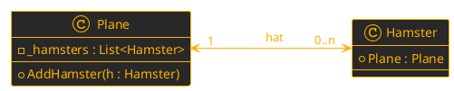
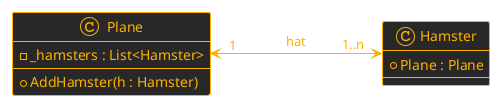

**Zettelübung: Beziehungen – Klassenebene vs. Objektebene**

**Name:** 
_ _ _ _ _ _ _ _ _ _ _ _ _ _ _ _ _ _ _ _ _ _ _ _ _ _ _ 
**Datum:** 
_ _ _ _ _ _ _ _ _ _ _ _ 

**Klassendiagramm**
Gegeben ist das folgende Klassendiagramm. Es zeigt eine bidirektionale 1-zu-n-Beziehung zwischen einer ``Plane`` und vielen `Hamstern`.



---

**Übung 1: Code-Analyse – Klassenebene oder Objektebene?**
Betrachte die folgenden drei C#-Implementierungen für das Hinzufügen eines Hamsters. Beurteile für jede Variante, ob die ``Bidirektionalität`` auf der Ebene der ``Klassen`` oder der Ebene der ``Objekte`` korrekt hergestellt wird. 

**Kreuze an und begründe kurz.**

#### Variante A:
```csharp
public class Plane 
{
    private List<Hamster> _hamsters = new List<Hamster>();

    public void AddHamster(Hamster hamster) 
    {
        _hamsters.Add(hamster);
    }
}

public class Hamster 
{
    public Plane Plane { get; set; }
}
```
**Klassenebene bidirektional?**&emsp;&emsp;&emsp;🔲 Ja  🔲 Nein
**Objektebene bidirektional?**&emsp;&emsp;&emsp;&nbsp;🔲 Ja  🔲 Nein
**Mutiplizität ***immer*** eingehalten?**&emsp;🔲 Ja  🔲 Nein
**Begründung:**

_ _ _ _ _ _ _ _ _ _ _ _ _ _ _ _ _ _ _ _ _ _ _ _ _ _ _ _ _ _ _ _ _ _ _ _ _ _ _ _ 
_ _ _ _ _ _ _ _ _ _ _ _ _ _ _ _ _ _ _ _ _ _ _ _ _ _ _ _ _ _ _ _ _ _ _ _ _ _ _ _ 

#### Variante B:
```csharp
public class Plane 
{
    public void AddHamster(Hamster hamster) 
    {
        hamster.Plane = this;
    }
}

public class Hamster 
{
    public Plane Plane { get; set; }
}
```
**Klassenebene bidirektional?**&emsp;&emsp;&emsp;🔲 Ja  🔲 Nein
**Objektebene bidirektional?**&emsp;&emsp;&emsp;&nbsp;🔲 Ja  🔲 Nein
**Mutiplizität ***immer*** eingehalten?**&emsp;🔲 Ja  🔲 Nein
**Begründung:**
$\\$
$\\$
$\\$
_ _ _ _ _ _ _ _ _ _ _ _ _ _ _ _ _ _ _ _ _ _ _ _ _ _ _ _ _ _ _ _ _ _ _ _ _ _ _ _ 
_ _ _ _ _ _ _ _ _ _ _ _ _ _ _ _ _ _ _ _ _ _ _ _ _ _ _ _ _ _ _ _ _ _ _ _ _ _ _ _ 

#### Variante C:
```csharp
public class Plane 
{
    private List<Hamster> _hamsters = new List<Hamster>();

    public void AddHamster(Hamster hamster) 
    {
        _hamsters.Add(hamster);
        hamster.Plane = this;
    }
}

public class Hamster 
{
    public Plane Plane { get; set; }
}
```
**Klassenebene bidirektional?**&emsp;&emsp;&emsp;🔲 Ja  🔲 Nein
**Objektebene bidirektional?**&emsp;&emsp;&emsp;&nbsp;🔲 Ja  🔲 Nein
**Mutiplizität ***immer*** eingehalten?**&emsp;🔲 Ja  🔲 Nein
**Begründung:**
$\\$
$\\$
$\\$
_ _ _ _ _ _ _ _ _ _ _ _ _ _ _ _ _ _ _ _ _ _ _ _ _ _ _ _ _ _ _ _ _ _ _ _ _ _ _ _ 
_ _ _ _ _ _ _ _ _ _ _ _ _ _ _ _ _ _ _ _ _ _ _ _ _ _ _ _ _ _ _ _ _ _ _ _ _ _ _ _ 

#### Variante D:
```csharp
public class Plane 
{
    public List<Hamster> Hamsters { get; } = new List<Hamster>();

    public Plane() 
    { 
    } 

    public Plane(Hamster hamster) 
    { 
        AddHamster(hamster) 
    } 

    public void AddHamster(Hamster hamster) 
    {
        _hamsters.Add(hamster);
        h.Plane = this;
    }
}

public class Hamster 
{
    public Plane Plane { get; } 
    
    public Hamster(Plane plane) 
    {
        Plane = plane;
        Plane.Hamsters.Add(this); 
    }
}
```
**Klassenebene bidirektional?**&emsp;&emsp;&emsp;🔲 Ja  🔲 Nein
**Objektebene bidirektional?**&emsp;&emsp;&emsp;&nbsp;🔲 Ja  🔲 Nein
**Mutiplizität ***immer*** eingehalten?**&emsp;🔲 Ja  🔲 Nein
**Begründung:**

___ 

**Übung - freiwillig:**


* Was ist anders im ``Klassendiagramm``?
* Was entsteht hier für ein Problem wenn wir in den ``Konstruktoren`` *public Hamster(Plane plane)* und *public Plane(Hamster hamster)* haben?
* Lies den Code durch welches dieses Problem löst und ***volliehe nach*** warum es funktioniert.

```csharp
public class Plane
{
    public HashSet<Hamster> Hamsters { get; } = new HashSet<Hamster>();

    private Plane() { }

    public void AddHamster(Hamster hamster)
    {
        if (Hamsters.Add(hamster))
        {
            hamster.Plane = this;
        }
    }

    public static (Plane, Hamster) CreatePlaneWithOneHamster()
    {
        Plane p = new Plane();
        Hamster h = new Hamster(p);
        return (p, h);
    }
}

public class Hamster
{
    public Plane Plane
    {
        get { return field; }
        set
        {
            field = value;
            field.AddHamster(this);
        }
    }

    public Hamster(Plane plane)
    {
        Plane = plane;
    }
}
```